# VOW Platform - Strategy Module Technical Specification & Schema Registry (v2.0 - Updated Specification)

**Document Version:** 2.0.0 (Updated Architecture Specification)  
**Target Audience:** AI Engineering, Backend Engineers, Frontend Engineers, Product Managers  
**Status:** Approved Technical Architecture Specification  

---

## 📌 Revision History & Change Tracking (v2.0)

| Comment # | Module / Topic | Technical Requirement Summary & Architectural Update |
| :--- | :--- | :--- |
| **1** | Section 2.5 (Inventory Tiers & 3P Targeting) | **Clarified 3P Inventory Targeting & Fee Consequences**:<br>- For 3P inventory (Netflix, Hulu, Disney+), targeting is NOT restricted to publisher-only.<br>- Advertisers have a choice between **Amazon DSP Targeting** (device/geo) or **Publisher / SSP Supply-Side Targeting** (deal-specific).<br>- Removed assumption that 3P targeting adds automatic extra CPM fees; fees are determined by audience data usage, not supply-side execution. |
| **2** | Section 2.4 (Audience Profiles & Fee Structure) | **Clarified Audience Data Fees & Profile Naming**:<br>- **Renamed "Broad" to "Wide"** per client vocabulary.<br>- **Clarified Data Fee Rules**: Fees are NOT determined by profile narrowness or number of segments.<br>- **Single Fixed CPM per Data Provider**: Using Amazon 1P data (Lifestyle/Interest) incurs 1 fixed CPM data fee regardless of how many 1P segments are selected (no compounding within same provider).<br>- **Cross-Provider Stacking**: If an audience set matches segments across *different* providers (e.g. Amazon 1P + 3P Experian data), both fees stack.<br>- **Effective CPM**: $\text{Effective CPM} = \text{Base Deal CPM} + \text{Stacked VCPM Data Fees}$. |
| **3** | Section 2.6 (CTV-First Agentic Flow & Budget Split) | **Clarified Budget Split Optionality & Purpose**:<br>- **Budget Split Step is OPTIONAL** in the agentic flow (the agent does not force users to manually split budget per inventory deal upfront).<br>- **PREFERRED FOR ACCURATE CPM**: Performing a budget split across deals is strongly preferred because it enables the agent to compute an accurate **Blended Effective CPM** across heterogeneous deals (e.g. Prime Video PG @ £28.88 + Netflix 3P @ £22.00). |
| **4** | Section 2.6 & 3.4 (Audience Selection Requirement) | **Audience Selection is OPTIONAL Again**:<br>- **Audience targeting is NOT mandatory** for creating a strategy.<br>- CTV & Prime Video campaigns can run on **Run-of-Service (ROS) / Contextual Deal Targeting** without selecting explicit audience segments.<br>- If no audience set is selected, **no VCPM data fee** is added to the base deal CPM. |
| **5** | Section 2.7 (Unified Targeting & Baseline Defaults) | **Unified Targeting & Default Baseline Architecture**:<br>- **Audiences treated as part of overall Targeting** (not an isolated mandatory step).<br>- **Default Baseline Applied Automatically**: Once inventory (CTV/Prime Video) is selected, baseline defaults are applied (`Country Geo-Targeting` + `Connected TV (CTV) Living Room Devices`).<br>- **Refinement Options**: Users can refine targeting via **Audience Segments**, **Postcodes / Zip codes** (e.g. `SW1A 1AA`), or accept baseline defaults as sufficient. |
| **6** | Section 2.8 (CTV Strategy Simplification) | **CTV Strategy Simplification & Inferred Defaults**:<br>- **Eliminated 15+ redundant multi-channel form questions** for CTV strategies.<br>- **Inferred Defaults**: Goal defaults to `AWARENESS`, KPI defaults to `reach`, Ad Formats default to `['streaming_tv']`, Base Bid defaults to `£30.00` rate card CPM, ASINs & Ad Tag pixels are omitted.<br>- **Minimal User Prompts**: User only needs to provide 4 core parameters: Name, Dates, Market, and Budget. |
| **7** | Section 3.1 (Auto-Generated Strategy Naming) | **Auto-Generated Strategy Naming Architecture**:<br>- **Strategy Name is NOT a blocking manual prompt**.<br>- **Auto-Generation Rules**: Agent automatically generates a structured name from brief context (e.g. `Education_UK_Awareness_Aug2026`).<br>- **Auto-Uniqueness Repair**: If duplicate check returns `false`, agent automatically appends version suffix (e.g. `_v2`) without forcing user manual intervention. |
| **8** | Section 2.9 (Multi-Market Agentic Architecture) | **Multi-Market Execution & Repeat-Prevention Architecture**:<br>- **Prevents Tedious Prompt Loops**: The agent NEVER loops or repeats questions per market sequentially in conversation.<br>- **Mode 1 (Single Market Primary - Recommended)**: 1 Strategy Card per primary market; multi-country expansion handled via 1-click Agentic Strategy Duplication.<br>- **Mode 2 (Multi-Market Parallel Aggregation)**: Executes API tool calls concurrently (`markets=GB,DE`), auto-splits total budget equally across countries, and auto-matches creative assets by country language code. |
| **9** | Section 3.1 (Automated Currency Inference) | **Automated Primary Currency Inference from Market Code**:<br>- **Elimination of Currency Prompt Question**.<br>- **Inference Rules**: Agent automatically derives currency from target market ISO code (`GB` $\rightarrow$ `GBP` £, `DE`/`FR`/`ES`/`IT` $\rightarrow$ `EUR` €, `US` $\rightarrow$ `USD` $).<br>- Only defaults to advertiser base currency if multi-market aggregated mode is selected. |
| **10** | Section 3.2 (Frequency KPI Target Value Range) | **Frequency KPI Target Value Range (1–5)**:<br>- **Frequency KPI Target Numeric Value**: When KPI target type is `frequency`, an explicit numeric target value between **`1` and `5`** impressions per user can be specified.<br>- **Default Frequency Target**: Defaults to `3` (standard CTV branding frequency cap). |
| **11** | Section 3.2 (Single Market Budget Input) | **Simplified Single Market Budget Input Architecture**:<br>- **Replaced Multi-Row Table Widget for Single Market**: For single-market campaigns, budget is entered as a simple numeric input (e.g. `Total Budget: £10,000.00`) instead of populating a multi-row table UI widget.<br>- Multi-row table is used only if multi-market aggregated mode is active. |
| **12** | Section 3.2 (Base CPM Bid Omission) | **Base Bid Omission & Deal CPM Pricing Architecture**:<br>- **Base Bid is NOT required for CTV**: For CTV/Prime Video strategies, base bid input is omitted.<br>- **Fixed Rate Card Pricing**: Pricing is defined entirely by the CPM of selected inventory deals (e.g., Prime Video PG @ £28.88). The agent does not prompt the user for a manual base bid. |
| **13** | Section 3.2 (Advertiser Default Frequency Cap) | **Advertiser Default Frequency Cap Architecture**:<br>- **Inherits Advertiser Profile Setting**: Frequency cap is optional in user prompts. If omitted, the Planning Agent automatically pulls and applies the **Advertiser Default Capping Settings** (e.g., 3 impressions per 24 hours). |
| **14** | Section 3.1 & 3.2 (Automated Format Default `streaming_tv`) | **Automated Format Default (`streaming_tv`)**:<br>- **Default Channel Format**: Format for DSP CTV strategies is always defaulted to **`streaming_tv`** (the core Amazon DSP entity format for Connected TV). Eliminates manual format selection prompts. |
| **15** | Section 3.1 (Product Category Brief Inference & Default) | **Product Category Brief Inference & Advertiser Default Architecture**:<br>- **Inferred from Brief or Advertiser Profile**: Product Category does NOT block the user. The agent infers the category directly from brief text context (e.g., "Degree program" $\rightarrow$ Education) or inherits the advertiser's default category profile. |
| **16** | Section 3.1 (Selling Location Omission for CTV) | **Selling Location Omission Architecture**:<br>- **Omitted for CTV Strategies**: Selling location (`ON_AMAZON` vs `NOT_SOLD_ON_AMAZON`) is omitted from user prompts for upper-funnel CTV branding campaigns. Field defaults internally to `NOT_SOLD_ON_AMAZON` or left null. |
| **17** | Section 3.1 (Deferred ASIN Collection "Comes Later") | **Deferred ASIN Collection Architecture ("Comes Later")**:<br>- **Deferred Downstream**: Entering ASINs is NOT required during initial strategy setup or brief parsing ("comes later"). ASIN collection and validation are handled downstream during campaign tracking setup. |
| **18** | Section 2.5 & 3.3 (Automated Deal Selection & CPM Abstraction) | **Automated Deal Selection & CPM Pricing Abstraction Architecture**:<br>- **Eliminated UI Checkbox Tables for Deals**: Users are NOT forced to browse or check technical deal tables.<br>- **Automated Background Matching**: The agent automatically selects optimal inventory deals from brief parameters (`market`, `duration`, `channel=streaming_tv`, optional `ROS`/`genre`).<br>- **CPM Abstraction**: Technical deal IDs are hidden; the platform surfaces ONLY the resulting Effective CPM rate card to the user.<br>- **Optional Custom Deal ID Override**: Users can specify an explicit deal ID in text if desired. |
| **19** | Section 2.4, 2.5 & 3.4 (Amazon Audience Applicability to 3P) | **Amazon Audience Applicability to 3P Inventory Architecture**:<br>- **Amazon 1P Audiences Apply to 3P Inventory**: Corrected previous restriction. Advertisers CAN apply Amazon native 1P audiences (in-market, lifestyle, demographic) to 3P inventory deals (Netflix, Disney+, Hulu, Roku) when buying via Amazon DSP.<br>- Standard Amazon 1P VCPM data fee applies when 1P data is used on 3P deals. |
| **20** | Section 2.4, 3.4 & 4.1 (Audience Suggestion API Response Shape) | **Audience Suggestion API Flat List Response Architecture**:<br>- **`bundles.narrow/balanced/broad` Not Supported**: Corrected open question. The suggest API `POST /api/audience-sets/suggest/` does NOT return pre-nested bundle objects.<br>- **Flat List Response**: Returns a flat list of recommended audience sets (`List[AudienceSet]`). The agent presents these items directly without requiring backend bundle grouping keys. |
| **21** | Section 2.7 & 3.4 (Location Geo-Targeting Market Country Default) | **Location Geo-Targeting Market Country Default Architecture**:<br>- **Defaults to Target Market Country**: Location geo-targeting is optional in user prompts. If omitted, location targeting automatically defaults to the full target market country (e.g. `GB` $\rightarrow$ United Kingdom, `DE` $\rightarrow$ Germany). |
| **22** | Section 2.7 & 3.4 (Device Type Advertiser Level Inheritance) | **Device Type Advertiser Level Setting & Inheritance Architecture**:<br>- **Inherits Advertiser Profile Preference**: Device type targeting is optional in prompts. If omitted, it automatically inherits the advertiser profile level preference (e.g. `CTV only` / Living Room Devices). |
| **23** | Section 2.6, 3.6 & 6.0 (Simplified Plan Approval & Finalization) | **Simplified Plan Approval & Direct Status Transition Architecture**:<br>- **No Manager Approval Required**: Plan approval is simplified to a single **status update** (`draft` $\rightarrow$ `finalised` / `active`). Manager approval routing workflows are omitted for now. |
| **24** | Section 3.6, 4.1 & 6.0 (Simplified Strategy Creation Endpoint) | **Simplified Strategy Creation Endpoint (`POST /api/simple-strategies/`) Architecture**:<br>- **`POST /api/simple-strategies/` Endpoint**: Strategy creation for simplified CTV campaigns uses the dedicated `POST /api/simple-strategies/` REST endpoint (or `/api/strategies/` alias).<br>- Accepts streamlined Pydantic payload omitting redundant multi-channel form fields. |
| **25** | Section 2.8 & 3.5 (Click-Through URL Optionality for Streaming TV) | **Click-Through URL Optionality for Streaming TV Architecture**:<br>- **Optional for `streaming_tv`**: For Connected TV / Streaming TV campaigns, providing a Click-Through URL is **Optional** (living room CTV ad placements are non-clickable branding experiences). Required only for Display/OLV. |
| **26** | Section 3.5 & 5.0 (Dynamic Channel-Level Creative Approval Status) | **Dynamic Channel-Level Creative Approval Status Architecture**:<br>- **Dynamic Dictionary Map**: Replaced hardcoded publisher-specific approval status fields (`Amazon/Netflix/Disney approval status`) with a dynamic per-channel approval dictionary: `channel_approval_statuses: Dict[str, ApprovalStatusEnum]`.<br>- Scales cleanly across any channel/partner (e.g., `amazon`, `netflix`, `disney_plus`, `paramount_plus`, `channel_4`, `roku`). |
| **27** | Section 2.6, 2.8 & 6.0 (Flexible Non-Sequential Downstream Execution) | **Flexible Non-Sequential Downstream Execution Architecture**:<br>- **No Strict Order Required**: Downstream setup modules (**Tracking Setup**: ASINs / pixels vs **Creatives Binding**: video files / URLs) are decoupled and non-sequential.<br>- Tracking setup can be performed *before* creative binding if video assets are still in production, or vice-versa. |
| **28** | Section 2.1, 2.8 & 4.1 (Post-Creation Strategy Field Updates) | **Post-Creation Strategy Field Updates Architecture**:<br>- **Post-Creation Field Updates Supported**: Resolved open question. `product_location`, `product_asins`, and tracking parameters do NOT block initial strategy creation.<br>- They can be updated on the strategy object post-creation via `PATCH /api/strategies/{id}/` at any time. |

---

## 1. Executive Summary & Core System Architecture

This document serves as the **Single Source of Truth (SSOT)** for the **Strategy Module** and the **Planning Agent** within the VOW Advertising Platform. It defines the system architecture, business rules, field-by-field schema matrices, REST API integration contracts, Pydantic data models, and the state-machine execution flow.

```
                  +-------------------------------------------------------+
                  |               USER INTERFACE / BRIEF INPUT            |
                  +-------------------------------------------------------+
                                              |
                                              v
                  +-------------------------------------------------------+
                  |         LANGGRAPH PLANNING AGENT (STATE ENGINE)        |
                  |  - Stateful Slot Filling & Slot Verification          |
                  |  - Schema Validation via Pydantic Data Models         |
                  |  - Automated Natural Language Brief Extractor         |
                  +-------------------------------------------------------+
                                              |
                                              v
                  +-------------------------------------------------------+
                  |              VOW REST API ENGINE / TOOLS              |
                  |  - Uniqueness & ASIN Validation Calls                 |
                  |  - Audience Vector Search & Suggestion Engine         |
                  |  - Reach & Frequency Forecasting Engine               |
                  |  - Amazon DSP Campaign Entity Creation                |
                  +-------------------------------------------------------+
                                              |
                                              v
                  +-------------------------------------------------------+
                  |             DATABASE & AMAZON DSP SYNC ENGINE         |
                  +-------------------------------------------------------+
```

### Core Architectural Principles

1. **Zero-Hallucination Policy**: The Planning Agent NEVER invents strategy parameters, metrics, targeting criteria, or deal IDs out of its LLM weights. It only populates values verified against the VOW Database and official REST APIs.
2. **Self-Filling Form Paradigm**: The agent operates as a stateful slot-filling engine backed by **LangGraph**. Inputs received via natural language chat or uploaded brief documents are parsed into registered Pydantic slot schemas.
3. **API-Driven Tool Execution**: Every step of the strategy workflow maps directly to official VOW API endpoints for choice retrieval, validation, audience suggestion, reach forecasting, and campaign draft persistence.

---

## 2. Business Logic & Domain Architecture

### 2.1 Product Attribution & Selling Locations
- **On Amazon (`ON_AMAZON`) [Endemic]**:
  - Used when the advertiser sells products directly on Amazon marketplace.
  - **Product ASINs**: **REQUIRED for Tracking**. Entering valid ASINs enables tracking of Detail Page Views (DPV), Add to Cart (ATC), Purchases, and Return on Ad Spend (ROAS).
- **Off Amazon (`NOT_SOLD_ON_AMAZON`) [Non-Endemic]**:
  - Used when the advertiser drives traffic to an external direct-to-consumer (D2C) site, application, or landing page.
  - **Product ASINs**: **OPTIONAL**. If provided, ASINs are monitored to measure organic Amazon halo sales resulting from off-Amazon ad impressions.
  - **Ad Tag Conversions**: Required to track site events (Page Views, Add to Cart, Checkout, Application submissions).

#### Post-Creation Strategy Field Updates:
- **No Blocking Input Required Upfront**: `product_location` and `product_asins` are **NOT required** prior to strategy creation.
- A strategy can be created and published first (status `finalised` via `POST /api/simple-strategies/`), and then `product_location` / `product_asins` can be **updated on the strategy object post-creation** via `PATCH /api/strategies/{id}/`.

---

### 2.2 Attribution & Lookback Windows
- **Default Window**: 14-day post-view and post-click attribution window for DSP campaign performance reporting.

### 2.3 Deal Types & Pricing Models
- **Programmatic Guaranteed (PG)**: Reserved inventory with fixed CPM and guaranteed impression volume.
- **Preferred Deals**: Non-guaranteed inventory with agreed fixed CPM pricing.
- **Private Auctions**: Floor-priced competitive auctions across premium publisher inventory.

---

### 2.4 Audience Set Profiles & Data Fee Rules (Updated v2.0)

When generating recommended audience sets, the Planning Agent produces three distinct operational profiles:

1. **Narrow (High Precision)**: Highly targeted in-market and lifestyle segments with tight reach and elevated conversion intent. Risk of underdelivery if reach is constrained.
2. **Balanced (Recommended)**: Optimal blend of high-intent in-market segments and broader affinity audiences. Standard client recommendation.
3. **Wide (Maximum Scale)**: *(Renamed from "Broad" per client vocabulary)* Broad demographic and interest-based reach for top-of-funnel brand awareness with lower precision.

#### Audience Suggestion API Response Shape:
- **`bundles.narrow/balanced/broad` Object Nesting**: **Not currently supported by the API backend**.
- **Flat List Output**: The endpoint `POST /api/audience-sets/suggest/` returns a **flat array of recommended audience sets** (`List[AudienceSet]`). The agent presents these recommendations directly without expecting nested dictionary keys.

#### Audience Data Fee (VCPM) Rules:

```
+---------------------------------------------------------------------------------------------------+
|                               AUDIENCE DATA FEE (VCPM) RULES                                      |
+---------------------------------------------------------------------------------------------------+
|  1. Fee Trigger        : Fees are determined by WHICH data segments are used (Amazon 1P data      |
|                          like Lifestyle/Interest or 3P data providers), NOT by profile narrowness |
|                          or number of segments. Demographic targeting incurs no data fee.           |
|                                                                                                   |
|  2. Single Fixed CPM   : Using Amazon 1P data incurs 1 fixed CPM data fee. Adding multiple 1P     |
|                          segments from Amazon does NOT compound or multiply the fee.              |
|                                                                                                   |
|  3. Cross-Provider     : Data fees stack ONLY when matching segments across DIFFERENT data         |
|     Stacking            providers (e.g., Amazon 1P segment + Experian 3P segment).                |
|                                                                                                   |
|  4. Amazon Audiences   : Amazon 1P native audiences CAN be applied to 3P inventory deals            |
|     on 3P Deals         (Netflix, Disney+, Hulu, Roku) via Amazon DSP. Standard 1P fee applies.    |
|                                                                                                   |
|  5. Effective CPM      : Effective CPM = Base Deal CPM + Stacked VCPM Data Fees.                  |
+---------------------------------------------------------------------------------------------------+
```

---

### 2.5 Inventory Tiers, Reach Forecasting & Automated Deal Selection

Every inventory deal in the VOW platform belongs to an **Inventory Tier**. The Planning Agent **automatically selects inventory deals in the background** based on campaign requirements (`market`, `flight_dates`, `channel=streaming_tv`, optional `genre`/`ROS`).

```
+---------------------------------------------------------------------------------------------------+
|                  AUTOMATED DEAL SELECTION & CPM ABSTRACTION ARCHITECTURE                          |
+---------------------------------------------------------------------------------------------------+
|  1. No Technical Checkbox Table : The platform removes the technical UI deal selection table.    |
|  2. Automated Background Match  : Agent queries deals endpoint GET /api/deals/?markets={market}   |
|                                    and matches optimal deals from brief parameters automatically. |
|  3. User CPM Abstraction        : Technical Deal IDs are hidden from the user. Only the resulting  |
|                                    Rate / Effective CPM pricing (e.g. £28.88) is surfaced.        |
|  4. Custom Deal ID Override     : Users can optionally specify a custom Deal ID in their prompt.   |
+---------------------------------------------------------------------------------------------------+
```

| Tier | Examples | Deal Selection Status | Reach Forecast Availability | Audience Targeting Options & Fee Structure |
| :--- | :--- | :--- | :--- | :--- |
| **Amazon Owned** | Prime Video, Freevee, Twitch | Auto-selected by Agent | ✅ **Available** | **Amazon Audiences**: Native 1P Amazon in-market, demographic, and lifestyle segments applied directly inside Amazon DSP. |
| **3P Pre-Curated** | Netflix, Hulu, Roku, Paramount+ | Auto-selected by Agent | ❌ **Not Available** (External reach engine) | **Targeting Choice**:<br>Advertisers can use **Amazon 1P Audiences** or **Publisher / SSP Supply-Side Targeting**. Data fee applies if 1P data used. |
| **3P Needs Curation** | Disney+, Peacock, HBO Max | Rate-card CPM only; VOW curates post-IO | ❌ **Not Available** (External reach engine) | **Targeting Choice**: Custom Supply-Side / SSP targeting or Amazon DSP 1P / device targeting configured post-deal curation. |

---

### 2.6 CTV-First Agentic Flow (v5) & Budget Split Rules (Updated v2.0)

The Planning Agent supports the client-confirmed **CTV-First Agentic Flow (v5)**, which reorders the classical UI wizard step sequence:

| Step | Old Order (v1.1.0 Wizard) | New Order (v2.0 Agentic v5, Confirmed) | Purpose & Architecture Notes |
| :--- | :--- | :--- | :--- |
| **1** | Strategy Details | **Basics (+ Flight Durations)** | Basic campaign identity, flight dates, market setup. Goal/KPI/Bid are folded in. |
| **2** | Goal, KPI & Bid | **CTV Inventory (Three-Tier Fork)** | Prioritizes CTV/Prime Video deals early in the conversation flow. |
| **3** | Deals | **Budget Split ➕ NEW (Optional)** | **Optional**, but **Strongly Preferred**. Enables computing precise Blended Effective CPM across deals. |
| **4** | Audience Sets | **Unified Targeting ➕ NEW** | Unifies Default Baseline (`Country` + `CTV Devices`) & Optional Refinement (`Audiences` or `Postcodes`). |
| **5** | Creatives | **Creatives & URLs** | Asset binding and landing page URL validation. |
| **6** | Summary & Forecast | **Summary, Reach Forecast & Launch** | Final card review, reach forecast curve generation, and **Direct Status Transition** (`draft` $\rightarrow$ `finalised`/`active`) via `POST /api/simple-strategies/`. |

#### Flexible Downstream Execution Architecture:
- **No Rigid Downstream Sequence**: Post-finalization downstream setup modules (**Tracking Setup**: ASIN validation & web conversion pixels vs **Creatives Binding**: asset upload & channel approvals) can be executed in **any order**.
- **Post-Creation Field Updates**: Fields such as `product_location` and `product_asins` can be attached or updated post-creation via `PATCH /api/strategies/{id}/`.

---

### 2.7 Unified Targeting & Default Baseline Architecture

Audiences are treated as a sub-component of overall **Unified Targeting**. Once inventory (CTV / Prime Video deals) is selected or inferred, the Planning Agent automatically establishes **Default Baseline Targeting**:

```
+---------------------------------------------------------------------------------------------------+
|                            UNIFIED TARGETING ARCHITECTURE                                         |
+---------------------------------------------------------------------------------------------------+
|  [AUTOMATED DEFAULT BASELINE]:                                                                    |
|  1. Country Geo-Targeting : ISO Country Code (Defaults to Target Market Country e.g. GB / UK)     |
|  2. Device Environment    : Connected TV (CTV) / Living Room Devices (Inherited from Advertiser)  |
|                                                                                                   |
|  [OPTIONAL TARGETING REFINEMENT BRANCHES]:                                                       |
|  - Branch A: Add Audience Segments  (Amazon 1P or 3P data fees stack per data provider)          |
|  - Branch B: Geo/Postcode Targeting (Specify Postcodes e.g. SW1A 1AA, W1A 1AA - No data fees)    |
|  - Branch C: Accept Baseline        (Run on ROS / Contextual deal targeting without extra filters)|
+---------------------------------------------------------------------------------------------------+
```

---

### 2.8 CTV Strategy Simplification & Inferred Defaults Architecture

To prevent user fatigue, the Planning Agent **simplifies prompts** for CTV-focused campaigns by **inferring standard CTV parameters** automatically:

| Parameter | Standard Multi-Channel UI Wizard Mode | CTV-Scoped Agent Mode | Inferred Default Value |
| :--- | :--- | :--- | :--- |
| **Strategy Name** | Prompt user for manual string | **Auto-Generated from Brief** | `{Category}_{Market}_{Goal}_{MonthYear}` |
| **Primary Currency** | Prompt user to select dropdown | **Inferred from Market** | `GB` $\rightarrow$ `GBP` (£), `DE` $\rightarrow$ `EUR` (€), `US` $\rightarrow$ `USD` ($) |
| **Ad Formats** | Prompt user to pick from 4 choices | **Inferred Automatically** | `["streaming_tv"]` |
| **Product Categories**| Prompt user for dropdown selection| **Inferred from Brief / Advertiser Default** | Inferred from brief text or inherited from advertiser profile default |
| **Selected Deals** | Checkbox Table | **Automated Background Matching** | Auto-matched by agent; surfaces only CPM pricing |
| **Selling Location & ASINs**| Prompt for ASINs & selling location | **Omitted Upfront (Updated Post-Creation)** | Omitted upfront; updated on strategy entity post-creation |
| **Location Geo-Targeting**| Prompt for geographic regions | **Optional (Defaults to Market Country)** | Automatically defaults to full target market country (e.g. `GB` / UK) |
| **Device Type Targeting**| Prompt for device environments | **Optional (Inherits Advertiser Profile)** | Inherits advertiser profile preference (e.g. `CTV only`) |
| **Click-Through URL** | Prompt for landing page URL | **Optional for `streaming_tv`** | Optional for non-clickable CTV living room ads |
| **Downstream Setup Order**| Strict sequential step order | **Flexible / Non-Sequential** | Tracking setup & creative binding can occur in any order |
| **Plan Approval & Endpoint**| Multi-stage manager review | **Simplified `POST /api/simple-strategies/`** | Changes status to `finalised`; no manager approval required |
| **Strategy Goal** | Prompt user to pick from 3 goals | **Inferred Automatically** | `AWARENESS` |
| **KPI Target** | Prompt user to pick from 6 metrics | **Inferred Automatically** | `reach` (or `frequency` with target `1-5`) |
| **Ad Tag Conversions** | Prompt for web pixel tracking | **Omitted Upfront** | Updated post-creation on strategy entity |
| **Base CPM Bid** | Prompt for manual bid | **Omitted / Defined by Deal CPM** | Pricing derived from selected deal CPM rate card |
| **Frequency Cap** | Prompt for manual cap | **Inherits Advertiser Profile Default** | Automatically inherits advertiser default profile cap |
| **User Inputs Required**| **15+ Manual Form Fields** | **3 Core Simple Questions** | **Dates, Market, Budget** |

---

### 2.9 Multi-Market Execution & Repeat-Prevention Architecture

```
+---------------------------------------------------------------------------------------------------+
|                        MULTI-MARKET EXECUTION & REPEAT-PREVENTION RULES                           |
+---------------------------------------------------------------------------------------------------+
|  RULE 1: NO CONVERSATIONAL REPETITION                                                             |
|          The Planning Agent NEVER forces the user through repetitive question loops per country.  |
|                                                                                                   |
|  MODE A: SINGLE-MARKET PRIMARY (Recommended Default)                                              |
|          Each strategy card targets 1 primary market (e.g., GB). To expand to additional countries|
|          (e.g., DE, US), the agent provides a 1-click "Duplicate Strategy for DE" action button.    |
|                                                                                                   |
|  MODE B: MULTI-MARKET PARALLEL AGGREGATION                                                        |
|          If multiple markets are selected upfront (e.g., markets=["GB", "DE"]):                   |
|          1. API Aggregation : Agent executes API tool calls in parallel (markets=GB,DE).           |
|          2. Budget Split    : Agent automatically splits budget equally (e.g. £10k -> £5k GB, £5k DE)|
|          3. Asset Matching  : Agent auto-binds media assets matching country language codes.        |
+---------------------------------------------------------------------------------------------------+
```

---

## 3. End-to-End Strategy Wizard Specifications (6 Steps)

### 3.1 Wizard Step 1: Strategy Details (`step=0`)

```
+---------------------------------------------------------------------------------------------------+
|  New Strategy: DSP                                                     [Save as draft] [Discard] |
|  Strategy details (Step 1 of 5)                                                                  |
+---------------------------------------------------------------------------------------------------+
|  1. Strategy name               : [ Auto-Generated: Education_UK_Awareness_Aug2026          ] |
|  2. Flight dates                : [ Range Picker e.g. 01/08/2026 - 31/08/2026                 ] |
|  3. Target markets              : [ Dropdown e.g. United Kingdom (GB)                          ] |
|  4. Primary currency            : [ Inferred from Market Code: GBP (£)                       ] |
|  5. Formats                     : [ Defaulted: Streaming TV (streaming_tv)                   ] |
|  6. Product Categories          : [ Inferred from Brief: Education (1) / Advertiser Default   ] |
|  7. Product ASINs & Location    : [ Deferred downstream - Can be updated post-creation       ] |
+---------------------------------------------------------------------------------------------------+
```

---

### 3.2 Wizard Step 2: Goal, KPI & Bid (`step=1`)

```
+---------------------------------------------------------------------------------------------------+
|  New Strategy: DSP                                                     [Save as draft] [Discard] |
|  Goal, KPI & Bid (Step 2 of 5)                                                                   |
+---------------------------------------------------------------------------------------------------+
|  Goal & KPI:                                                                                      |
|  1. Goal Selection                     : [x] Awareness    [ ] Consideration    [ ] Conversion     |
|  2. KPI Target                         : [x] Reach        [ ] Frequency                           |
|  3. Frequency KPI Target Value (1-5)   : [ Input e.g. 3 (Active when KPI is frequency)             ] |
|  4. Frequency Cap                      : [ Inherits Advertiser Default (e.g. 3/24h)               ] |
|  5. Ad Tag Conversions (Off-Amazon)    : [ Omitted upfront - Can be updated post-creation         ] |
|                                                                                                   |
|  Budget & Bid Allocation:                                                                         |
|  6. Total Campaign Budget (Single Market): [ Input e.g. £10,000.00                                ] |
|  7. Base Bid (Defined by Deal CPM)     : [ Omitted in CTV - Pricing set by selected deals CPM    ] |
+---------------------------------------------------------------------------------------------------+
|  [Back]                                                                             [Next: Deals] |
+---------------------------------------------------------------------------------------------------+
```

---

### 3.3 Wizard Step 3: Deals Selection & CPM Summary (`step=2`)

```
+---------------------------------------------------------------------------------------------------+
|  New Strategy: DSP                                                     [Save as draft] [Discard] |
|  Deals & Inventory (Step 3 of 5) - Automated Inventory Match                                      |
+---------------------------------------------------------------------------------------------------+
|  Automated Inventory Selection:                                                                   |
|                                                                                                   |
|  🇬🇧 United Kingdom Inventory:                                                                    |
|  - Prime Video Preferred Deal (UK ROS 30s)  ----------------------------------> CPM £28.88 Fixed    |
|  - Optional 3P Inventory (Netflix / Paramount+) ----------------------------> CPM £22.00 Rate Card |
|                                                                                                   |
|  (User is shown Effective CPM rate cards; technical deal tables and checkboxes are omitted)       |
+---------------------------------------------------------------------------------------------------+
|  [Back]                                                                         [Next: Audiences] |
+---------------------------------------------------------------------------------------------------+
```

---

### 3.4 Wizard Step 4: Unified Targeting Module (`step=3`)

```
+---------------------------------------------------------------------------------------------------+
|  New Strategy: DSP                                                     [Save as draft] [Discard] |
|  Unified Targeting (Step 4 of 5)                                                                 |
+---------------------------------------------------------------------------------------------------+
|  Default Baseline Applied: [x] Country: GB (Target Market)  [x] Device: Connected TV (CTV) Only   |
|                                                                                                   |
|  Refinement Options:                                                                              |
|  [ ] Refine with Postcodes/Zip Codes: [ e.g. SW1A 1AA, W1A 1AA                                ]   |
|  [ ] Refine with Audience Segments:   [ Amazon 1P / 3P Data Audience Sets (Flat List API Shape)  ]   |
+---------------------------------------------------------------------------------------------------+
|  [Back]                                                                         [Next: Creatives] |
+---------------------------------------------------------------------------------------------------+
```

---

### 3.5 Wizard Step 5: Downstream Setup - Creatives & Tracking Modules (`step=4`)

```
+---------------------------------------------------------------------------------------------------+
|  New Strategy: DSP                                                     [Save as draft] [Discard] |
|  Downstream Setup (Flexible Modular Execution - Creatives OR Tracking Setup can be done first)   |
+---------------------------------------------------------------------------------------------------+
|  MODULE A: Creatives Binding & Approvals                                                          |
|  - Asset Selection Table & Optional Landing URLs (streaming_tv optional)                          |
|  - Per-Channel Approval Statuses: Dict[str, ApprovalStatusEnum]                                  |
|                                                                                                   |
|  MODULE B: Tracking Setup (Can also be updated post-creation via PATCH /api/strategies/{id}/)     |
|  - ASIN Validation (POST /api/contextual-targeting/{market}/asin-validation/)                    |
|  - Ad Tag Conversions Definitions (GET /api/conversions/definitions/)                             |
+---------------------------------------------------------------------------------------------------+
|  [Back]                                                                           [Next: Summary] |
+---------------------------------------------------------------------------------------------------+
```

---

### 3.6 Wizard Step 6: Summary & Strategy Creation (`step=5`)

```
+---------------------------------------------------------------------------------------------------+
|  New Strategy: DSP                                                     [Save as draft] [Discard] |
|  Summary (Step 6 of 6)                                                                            |
+---------------------------------------------------------------------------------------------------+
|  Summary Overview Cards:                                                                          |
|  1. Strategy Details [Edit] : Name, Dates, Markets, Currency                                      |
|  2. Goal, KPI & Bid [Edit]   : Goal: Awareness | Budget: £10,000.00 | Frequency Cap: Default     |
|  3. Deals [Edit]             : Auto-Matched Deals (CPM: £28.88)                                  |
|  4. Targeting [Edit]         : Baseline (GB Market Country, CTV Devices) + Optional Audiences    |
|  5. Creatives & Tracking     : Modular Setup (Assets, URLs, Channel Approvals, ASINs/Pixels)     |
+---------------------------------------------------------------------------------------------------+
|  [Back]                                           [Finalise Strategy via POST /api/simple-strategies/]|
+---------------------------------------------------------------------------------------------------+
```

---

## 4. API Catalog & Integration Contracts

### 4.1 Master REST Endpoint Matrix

| Operation ID | Method | Endpoint Path | Description |
| :--- | :--- | :--- | :--- |
| `strategies_choices_list` | `GET` | `/api/strategies/choices/` | Retrieves dropdown enum choices (goals, KPIs, channels, currencies). |
| `strategies_check_strategy_name_uniqueness` | `GET` | `/api/strategies/check_strategy_name_uniqueness/` | Validates uniqueness of strategy name string. |
| `contextual-targeting_asin-validation_create` | `POST` | `/api/contextual-targeting/{market}/asin-validation/` | Validates input ASIN list against Amazon Catalog API. |
| `contextual-targeting_product-categories_list` | `GET` | `/api/contextual-targeting/{market}/product-categories/` | Fetches available product categories for deal targeting. |
| `conversions_definitions_list` | `GET` | `/api/conversions/definitions/` | Fetches ad tag conversion definitions for off-Amazon strategies. |
| `deals_list` | `GET` | `/api/deals/` | Lists available programmatic deals filtered by format and market. |
| `deals_filter_properties` | `GET` | `/api/deals/filter-properties/` | Fetches filter facets (Ad length, Genre, Deal type). |
| `audience-sets_list` | `GET` | `/api/audience-sets/` | Lists pre-curated audience sets for target markets. |
| `audience-sets_suggest_create` | `POST` | `/api/audience-sets/suggest/` | Generates recommended audience sets via vector search (**Returns Flat List**). |
| `audience-sets_reach-forecast_create` | `POST` | `/api/audience-sets/reach-forecast/` | Forecasts unique reach and impressions for selected audience sets. |
| `assets_list` | `GET` | `/api/assets/` | Lists registered image/video media assets. |
| `creatives_list` | `GET` | `/api/creatives/` | Validates approved Amazon DSP creative tags. |
| `strategies_reach_forecast` | `POST` | `/api/strategies/reach-forecast/` | Calculates complete strategy reach and frequency curve. |
| `strategies_draft_create` | `POST` | `/api/strategies/draft/` | Persists partial draft strategy configuration. |
| `simple_strategies_create` | `POST` | `/api/simple-strategies/` | Creates and publishes CTV simplified strategy in VOW DB (`201 Created`). |
| `strategies_read` | `GET` | `/api/strategies/{id}/` | Reads created strategy overview details. |
| `strategies_update` | `PUT` | `/api/strategies/{id}/` | Full update of existing strategy fields (including post-creation ASINs & tracking). |
| `strategies_partial_update` | `PATCH` | `/api/strategies/{id}/` | Partial update of strategy fields post-creation. |

---

## 5. Python Pydantic Data Models (Production Grade)

```python
from enum import Enum
from typing import List, Optional, Dict, Any
from pydantic import BaseModel, Field, HttpUrl

# ==========================================
# ENUM DEFINITIONS
# ==========================================

class InventoryTierEnum(str, Enum):
    AMAZON_OWNED = "AMAZON_OWNED"
    THREE_P_PRE_CURATED = "THREE_P_PRE_CURATED"
    THREE_P_NEEDS_CURATION = "THREE_P_NEEDS_CURATION"

class TargetingLocationEnum(str, Enum):
    AMAZON_DSP = "AMAZON_DSP"
    SUPPLY_SIDE_SSP = "SUPPLY_SIDE_SSP"

class ChannelTypeEnum(str, Enum):
    DSP = "dsp"
    SPONSORED = "sponsored"

class GoalEnum(str, Enum):
    AWARENESS = "AWARENESS"
    CONSIDERATION = "CONSIDERATION"
    CONVERSION = "CONVERSION"

class KPIEnum(str, Enum):
    REACH = "reach"
    FREQUENCY = "frequency"
    CTR = "ctr"
    CPC = "cpc"
    CPA = "cpa"
    CPDPV = "cpdpv"

class ProductLocationEnum(str, Enum):
    ON_AMAZON = "ON_AMAZON"
    NOT_SOLD_ON_AMAZON = "NOT_SOLD_ON_AMAZON"

class FormatEnum(str, Enum):
    DISPLAY = "display"
    ONLINE_VIDEO = "online_video"
    STREAMING_TV = "streaming_tv"
    PRIME_VIDEO = "prime_video"

class CurrencyEnum(str, Enum):
    EUR = "EUR"
    GBP = "GBP"
    USD = "USD"

class StrategyStatusEnum(str, Enum):
    DRAFT = "draft"
    FINALISED = "finalised"
    ACTIVE = "active"
    PAUSED = "paused"

class ApprovalStatusEnum(str, Enum):
    APPROVED = "APPROVED"
    PENDING = "PENDING"
    REJECTED = "REJECTED"
    NOT_SUBMITTED = "NOT_SUBMITTED"

# ==========================================
# STEP-BY-STEP SLOT SCHEMAS
# ==========================================

class DateRangeSchema(BaseModel):
    lower: str = Field(..., description="ISO Date String YYYY-MM-DD")
    upper: str = Field(..., description="ISO Date String YYYY-MM-DD")
    bounds: str = Field("[)", description="Interval boundary notation")

class Step1DetailsSlotSchema(BaseModel):
    """Slots extracted in Step 1: Strategy Details"""
    name: Optional[str] = Field(None, description="Strategy Name (Auto-generated if omitted e.g. Education_UK_Awareness_Aug2026)")
    flight_dates: DateRangeSchema = Field(..., description="Campaign Flight Date Range")
    markets: List[str] = Field(..., description="ISO 2-letter Country Codes e.g. ['GB']")
    primary_currency: Optional[CurrencyEnum] = Field(None, description="Inferred automatically from market e.g. GB -> GBP")
    formats: List[FormatEnum] = Field(default=[FormatEnum.STREAMING_TV], description="Selected Ad Formats (Defaults to streaming_tv)")
    product_categories: List[int] = Field(default_factory=list, description="Product category IDs (Inferred from brief or advertiser default)")
    product_location: Optional[ProductLocationEnum] = Field(None, description="ON_AMAZON | NOT_SOLD_ON_AMAZON (Can be updated post-creation via PATCH)")
    product_asins: List[str] = Field(default_factory=list, description="Product ASINs list (Deferred downstream - can be updated post-creation via PATCH)")

class MarketBudgetBidSchema(BaseModel):
    market: str = Field(..., description="ISO 2-letter Country Code")
    budget: str = Field(..., description="Total Budget Decimal String")
    base_bid: Optional[str] = Field(None, description="Base CPM Bid (Omitted in CTV, derived from deal CPM)")

class Step2GoalKPIBidSlotSchema(BaseModel):
    """Slots extracted in Step 2: Goal, KPI & Bid"""
    goal: GoalEnum = Field(GoalEnum.AWARENESS, description="Primary Strategy Goal (Defaults to AWARENESS for CTV)")
    kpi_target_type: KPIEnum = Field(KPIEnum.REACH, description="Primary Metric Target (reach | frequency)")
    kpi_target_value: Optional[int] = Field(default=3, ge=1, le=5, description="Frequency target (1-5) when kpi_target_type is frequency")
    frequency_cap: Optional[Dict[str, Any]] = Field(None, description="Custom frequency cap dict. Inherits advertiser profile default if omitted.")
    ad_tag_conversions: List[str] = Field(default_factory=list, description="Tracked Ad Tag Conversion Events (Can be updated post-creation)")
    market_budgets: List[MarketBudgetBidSchema] = Field(..., description="Budget Allocations (Single input mapped per market)")

class SelectedDealSchema(BaseModel):
    deal_id: str = Field(..., description="Deal ID e.g. EXT7P75718S8MNR (Auto-matched by agent or custom override)")
    name: str = Field(..., description="Deal Name")
    cpm: str = Field(..., description="Fixed or Floor CPM Price (Surfaced to user)")
    inventory_tier: InventoryTierEnum = Field(..., description="AMAZON_OWNED | THREE_P_PRE_CURATED | THREE_P_NEEDS_CURATION")
    targeting_choice: TargetingLocationEnum = Field(TargetingLocationEnum.AMAZON_DSP, description="AMAZON_DSP | SUPPLY_SIDE_SSP")
    allocated_budget_percentage: Optional[float] = Field(None, description="Percentage of total budget allocated to this deal")

class Step3DealsSlotSchema(BaseModel):
    """Slots extracted in Step 3: Deals Selection"""
    selected_deals: List[SelectedDealSchema] = Field(..., description="Auto-matched Inventory Deals with CPM pricing")

class SelectedAudienceSetSchema(BaseModel):
    audience_set_id: str = Field(..., description="Audience Set UUID")
    name: str = Field(..., description="Audience Set Name")
    vcpm_fee: str = Field(..., description="VCPM Fee Decimal")

class UnifiedTargetingSlotSchema(BaseModel):
    """Slots extracted in Step 4: Unified Targeting"""
    locations: List[str] = Field(default_factory=list, description="Geo location ISO country/region codes. Defaults to target market country if empty.")
    device_types: List[str] = Field(default=["CTV"], description="Device types (Inherits advertiser profile preference e.g. CTV only)")
    postcodes: List[str] = Field(default_factory=list, description="Optional Postcodes / Zip codes for Geo targeting")
    matching_mode: str = Field("Exact", description="Similar | Exact")
    selected_audience_sets: List[SelectedAudienceSetSchema] = Field(default_factory=list, description="Optional Selected Audience Sets (Flat list from suggest API)")

class SelectedCreativeSchema(BaseModel):
    asset_id: str = Field(..., description="Media Asset UUID")
    asset_name: str = Field(..., description="Media Asset File Name")
    click_through_url: Optional[HttpUrl] = Field(None, description="Optional landing page URL for streaming_tv (Required for Display/OLV)")
    channel_approval_statuses: Dict[str, ApprovalStatusEnum] = Field(
        default_factory=dict, 
        description="Read-only approval status per inventory channel (e.g. {'amazon': 'APPROVED', 'paramount_plus': 'PENDING'})"
    )

class Step5CreativeSlotSchema(BaseModel):
    """Slots extracted in Step 5: Creatives Binding & Channel Approvals"""
    selected_creatives: List[SelectedCreativeSchema] = Field(..., description="Selected Media Assets with optional landing page URLs and per-channel approval statuses")

# ==========================================
# COMPREHENSIVE FULL STRATEGY SCHEMA
# ==========================================

class FullStrategySchema(BaseModel):
    id: Optional[str] = Field(None, description="System Assigned Strategy ID (e.g. VMA2026365)")
    advertiser_id: str = Field(..., description="Parent Advertiser UUID")
    channel_type: ChannelTypeEnum = ChannelTypeEnum.DSP
    details: Step1DetailsSlotSchema
    goal_kpi_bid: Step2GoalKPIBidSlotSchema
    deals: Step3DealsSlotSchema
    targeting: UnifiedTargetingSlotSchema
    creatives: Step5CreativeSlotSchema
    status: StrategyStatusEnum = Field(StrategyStatusEnum.FINALISED, description="draft | finalised | active | paused")
    is_syncing: bool = Field(False, description="Background DSP sync status")
```

---

## 6. LangGraph Planning Agent State Machine & Workflow

```mermaid
stateDiagram-v2
    [*] --> ParseUserPromptNode: User message or brief uploaded
    ParseUserPromptNode --> ValidateSlotSchemaNode: Extract parameters into Pydantic model (Auto-Generate Name & Infer Currency)
    
    state ValidateSlotSchemaNode {
        [*] --> CheckStep0: Check Strategy Name & Flight Dates (Infer Currency, Format=streaming_tv, Category & CTV Defaults)
        CheckStep0 --> CheckStep1: Check Single Budget Input (Infer Goal=Awareness, KPI=Reach/Frequency(1-5), Base Bid & Location Omitted)
        CheckStep1 --> CheckStep2: Auto-Match Inventory Deals from Brief Context (Surface CPM pricing only)
        CheckStep2 --> CheckStep3: Apply Default Baseline (Market Country Geo + Inherited Advertiser Device Type) & Optional Refinements
        
        state DownstreamModularSetup {
            [*] --> ModularTrackingSetup: ASIN validation & web pixels (Optional Order - Can be updated post-creation via PATCH)
            [*] --> ModularCreativesSetup: Creatives binding & per-channel approvals (Optional Order)
        }
        
        CheckStep3 --> DownstreamModularSetup
    }

    ValidateSlotSchemaNode --> InvokeToolNode: If validation passes, call VOW API
    InvokeToolNode --> ForecastRepairLoopNode: Call /api/strategies/reach-forecast/
    
    state ForecastRepairLoopNode {
        [*] --> EvaluateReach: Check if reach > 0 and frequency within targets
        EvaluateReach --> AutoWidenAudience: If reach == 0, switch from Narrow to Broad bundle
        AutoWidenAudience --> EvaluateReach
    }

    ForecastRepairLoopNode --> PresentCardToUserNode: Render interactive strategy proposal card
    PresentCardToUserNode --> ExecuteStrategyCreateNode: User confirms creation -> POST /api/simple-strategies/ with status 'finalised'
    ExecuteStrategyCreateNode --> PostCreationUpdateNode: Optional post-creation field updates via PATCH /api/strategies/{id}/
    PostCreationUpdateNode --> [*]: Published & Active Strategy
```


