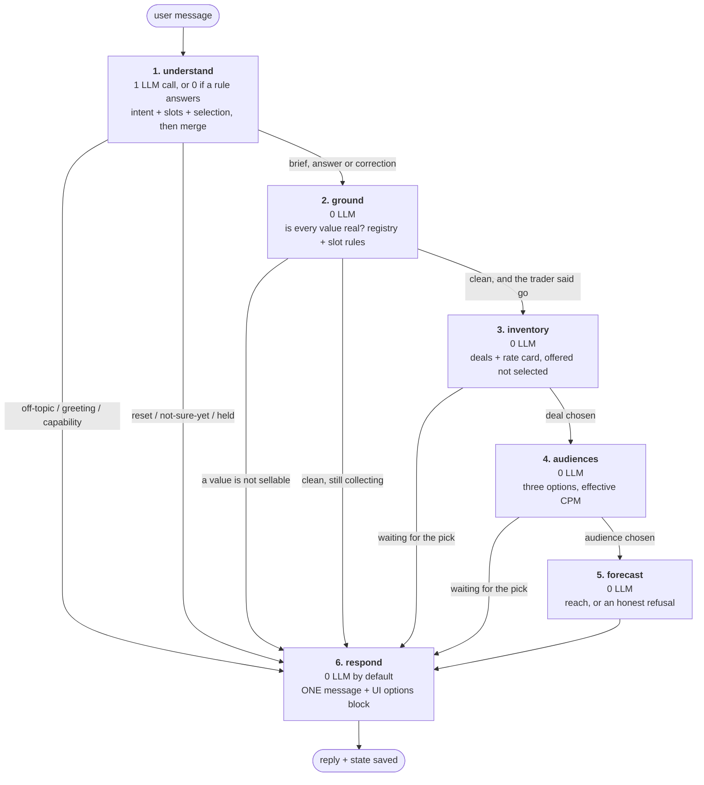
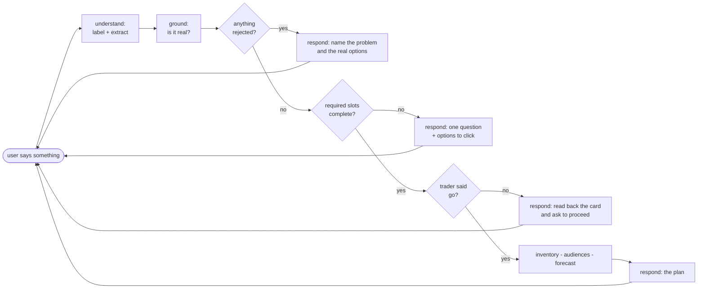

# Planning Agent — Flow Redesign (discussion document, no code changes)

Written against the three asks in `discussion.txt`:

1. Drop the classify node — two LLM calls per turn is time and money we should not spend.
2. Keep only the number of nodes the requirement actually needs.
3. Decide the off-track behaviour (greetings, weather, places, general questions) **at the
   extraction level**, not by adding nodes later.

Nothing here is implemented yet. This is the flow to agree on first.

---

## 1. What the current flow actually costs

Measured, not estimated — from `logs.json`, one real session:

| Turn | Message | LLM calls | Total | Where the time went |
|---|---|---|---|---|
| 1 | "I want to plan to run a campaign in the China" | **3** | **4713 ms** | classify 1602 ms + extract 1707 ms + question phrasing 1384 ms = 4693 ms |
| 2 | "ok lets go for GB" | 0 (rules) | 64 ms | no model call at all |

Two things this proves:

- **99.6% of a model turn is LLM latency.** Every other node in that turn cost 4 ms
  (grounding) or less. The node count is not the performance problem; the call count is.
- **The classify prompt was 1924 input tokens for a 45-character message.** It carries the
  stage contracts, the intent definitions and the plan context — and then the extract call
  sends almost the same context again.

So the target is not "fewer nodes". The target is:

> **One LLM call per turn, and zero on turns a rule can answer.**

Node count comes down as a consequence, because most nodes were never the cost.

---

## 2. The one design decision that removes the second call

Classification and extraction read **the same input** and need **the same context**:

| | Input | Context needed |
|---|---|---|
| classify | trader's message | what is known, what was asked, what is on screen |
| extract | trader's message | what is known, what was asked, what is on screen |

They are one question asked twice. So they become one structured-output call:

```
UnderstandResult:
    intent      : one of a closed list        <- was classify_intent
    fields      : every slot the message set  <- was extract_fields
    selection   : which option was picked     <- was classify_intent
    off_topic   : weather | places | general | none
```

One prompt, one round trip, one bill. Everything the two nodes did afterwards was already
plain code — merging state, invalidating derived fields, applying a choice — and code does
not need a node of its own.

**This is also where the off-track rule belongs**, which is exactly what was asked for: the
same call that reads the brief also says "this is a weather question", and one line of code
decides that nothing gets written to the plan.

---

## 3. Node flowchart — 6 nodes



**Only node 1 talks to the model.** Nodes 2 to 5 are arithmetic and API reads. Node 6 is
templates plus the registry phrasebook, with an optional polish call that can be switched
off for a demo.

### What each node does

| # | Node | LLM | Job | Ends the turn? |
|---|---|---|---|---|
| 1 | `understand` | 1 or 0 | Label the message, pull out every slot it carries, apply a choice to whatever question is open, merge into what was already known, invalidate anything derived from a value that changed | no |
| 2 | `ground` | 0 | Every value checked against live VOW data — market sellable, duration on the rate card, currency valid, deal ID real — plus the rules the snapshot has no data for, such as a flight in the past | no |
| 3 | `inventory` | 0 | `GET /deals/` + `GET /rates/ctv/{market}/`, parse the channel out of each deal name with a confidence, classify the tier, count what was filtered out | no |
| 4 | `audiences` | 0 | Three profiles priced against the selected inventory — effective CPM = deal CPM + VCPM fee, in Decimal | no |
| 5 | `forecast` | 0 | Reach forecast for Amazon-owned inventory; for third-party, say plainly that reach cannot be forecast and give impressions instead | no |
| 6 | `respond` | 0 or 1 | The only node that speaks. Picks **one** thing to say, and emits the machine-readable options block the UI renders as radio buttons or cards | **yes, always** |

### Where today's 19 nodes go

Nothing is deleted. The work moves; the node disappears.

| Today | Goes to | Why it stops being a node |
|---|---|---|
| `classify_intent` | `understand` | same LLM call as extraction |
| `extract_fields` | `understand` | — |
| `validate_basics` | `ground` | both validators answer "is this usable?" |
| `validate_slots` | `ground` | same, for the rules the snapshot has no data for |
| `suggest_basics` | `respond` | advice is a kind of message, not a stage |
| `confirm_basics` | `respond` | the go-ahead question is a message |
| `select_inventory` | `inventory` + `respond` | fetch and wording split apart |
| `suggest_audiences` | `audiences` + `respond` | same split |
| `predict_reach` | `forecast` | renamed |
| `deliver_plan` | `respond` | the plan is a message |
| `apply_deal` | `understand` | applying a choice is a state write, pure code |
| `apply_audience` | `understand` | same |
| `ask_for_missing` | `respond` | asking is a message |
| `answer_question` | `respond` + one tool read | same |
| `reply_from_registry` | `respond` | same |
| `park_question` | `understand` | an intent with a code path |
| `start_over` | `understand` | same |
| `offer_repair` | `understand` + `respond` | same |
| `resolve_locations` | deferred | needs its own tool reads; out of M0/M1 scope |

**The structural idea:** separate *computing* from *speaking*. Fourteen of the nineteen
nodes existed because each one both worked something out **and** said something, so each
needed its own turn-ending gate. Once one node owns speaking, the rest are steps.

---

## 4. Turn lifecycle and the call budget

```
                        TODAY                          PROPOSED
                        -----                          --------
user message
  classify_intent       LLM  1602 ms
  extract_fields        LLM  1707 ms         understand      LLM  ~1700 ms
  validate_basics             4 ms           ground                 4 ms
  ask (phrasing)        LLM  1384 ms         respond          template, ~1 ms
                        ------------                         ---------------
                        3 calls, 4713 ms                     1 call, ~1705 ms
```

| Turn type | Today | Proposed |
|---|---|---|
| Full or partial brief | 3 calls | **1** |
| Bare "yes", a named option, a greeting, "thanks" | 0 (rules already) | **0** |
| Question about the plan | 2 calls | **1** |
| Off-topic (weather, places, general) | 2 calls | **0** — rules catch these before the model |

Roughly **a third of the tokens and a third of the latency**, and the demo feels different at
1.7 s versus 4.7 s.

### How unnecessary calls are avoided

1. **Rules before the model, always.** Bare agreement, bare refusal, a named option on
   screen, a greeting, "not sure yet" — all decided by pattern. In the log, turn 2 took
   64 ms because of this. Widen this set and the average call count keeps falling.
2. **One prompt instead of two.** Section 2.
3. **A no-op turn does no work.** If the merge moved nothing, the flow stops at `respond`
   and says so — it does not re-fetch inventory to produce the same reply again.
4. **`respond` is templates first.** A rotating opener, a computed sentence and a grounded
   options list read as conversational without a model call. The polish call is optional
   and skipped for acknowledgements.
5. **Snapshot cached per advertiser.** Grounding reads a cached snapshot; a fetch happens on
   a cache miss, a TTL expiry, or the first time a market is asked for — not per turn.

---

## 5. Off-track behaviour, decided at the extraction level

One closed list, returned by the same call that extracts. Nothing else is added.

| Intent | Example | Writes to plan? | Answer comes from |
|---|---|---|---|
| `BRIEF` | "CTV in the UK, £50k, October, 30s" | yes | — |
| `ANSWER` | "30 seconds", "Prime Video", "the first one" | yes | — |
| `CORRECTION` | "make it £80k", "GB not CN" | yes | — |
| `GO_AHEAD` | "yes", "let's do it", "show me" | starts the next step | — |
| `HELD` | "no", "not yet" | no | phrasebook |
| `NO_ANSWER_YET` | "not sure", "you decide" | no, and the slot stays open | phrasebook |
| `NOT_GOOD_ENOUGH` | "that reach feels low" | no, offers a lever | computed |
| `START_OVER` | "scrap that, start again" | clears the plan | phrasebook |
| `CAMPAIGN_QUESTION` | "how many deals in GB?", "what does 15s cost?" | **no** | live tool read |
| `CAPABILITY` | "what can you do?" | no | phrasebook |
| `GREETING` / `PLEASANTRY` | "hi", "thanks" | no | phrasebook |
| `OFF_TOPIC` | weather, places, current affairs, general knowledge | **no** | phrasebook |
| `UNCLEAR` / `EMPTY` | — | no | phrasebook |

Two rules make this airtight, and both are code rather than prompt:

> **Rule 1 — only four intents may touch the plan:** `BRIEF`, `ANSWER`, `CORRECTION`,
> `START_OVER`. Everything else reaches `respond` with the plan untouched. A greeting
> cannot corrupt a campaign because there is no path from it to a state write.

> **Rule 2 — the model labels an off-topic message; it never answers one.** The reply comes
> from the phrasebook. This is what stops the agent giving a weather report in a friendly
> tone. It cannot answer what it is not given words for.

Off-topic wording lives in the registry YAML, so it can be tuned without a deploy:

```
Sorry, that one is outside what I do. I plan CTV campaigns - market, dates,
creative lengths, budget, inventory and audiences. Where would you like to start?
```

**A campaign question is not off-track.** "How many deals are there in GB?" is answered from
live data and the plan is left alone. Only genuinely unrelated subjects get the phrasebook
refusal — otherwise the agent feels obstructive rather than focused.

---

## 6. The user to agent to user flow

### The loop, in one picture



The loop continues until every required slot is filled and each step's choice has been made.
Optional slots are offered, never demanded.

### Conversation A — everything in one message

```
USER   CTV campaign in the UK for October 2026, £50,000, 30 second creatives

       understand  1 LLM call - BRIEF, four slots set
       ground      GB sellable, 30s on the GB rate card, flight in the future
       respond     card + go-ahead question, with the card as UI fields

AGENT  Perfect - here is what I have:
       GB . £50,000 . Oct 1-31 . 30s . Awareness
       Shall I pull up what is available in GB with the rate card?
       [ Yes, show me ]  [ Change something ]

USER   yes

       understand  0 LLM calls - rule matched a bare agreement
       inventory   9 GB deals total, 3 match 30s
       respond     numbered rows + the pick question

AGENT  GB has 9 CTV deals; 3 of them run a 30 second creative.
       1. Prime Video - Amazon-owned - GBP 28.88 CPM - 30s
       2. Tubi - third-party - GBP 19.40 CPM - 15s only
       3. Discovery+ - third-party - GBP 31.25 CPM - lengths not stated
       Go with Prime Video, or see the wider inventory first?
       [ Prime Video ]  [ Show wider inventory ]

USER   Prime Video

       understand  0 LLM calls - the option is on screen, matched by name
       audiences   three profiles priced off 28.88
       respond     options + the choice question

AGENT  Prime Video it is - Amazon-owned, so I can forecast reach on it.
       Three audiences:
       NARROW (recommended) - In-market streaming - 1.2M people - 30.51 CPM
       BALANCED - Entertainment 25-54 - 4.8M people - 30.51 CPM
       WIDE - Adults 18+ - 15.4M people - 28.88 CPM
       The fee depends on the data used, not on how broad the pool is.
       Which one? Or skip audiences and run broad - no data fee that way.
       [ Narrow ]  [ Balanced ]  [ Wide ]  [ Skip audiences ]

USER   balanced

       understand  0 LLM calls
       forecast    VOW reach forecast
       respond     the whole plan, once

AGENT  [complete plan card: market, flight, durations, budget, inventory,
        audience, impressions, unique reach, frequency, effective CPM]
       Say the word and I will create this strategy in VOW.
       [ Create strategy ]  [ Change something ]
```

**Five turns. One LLM call in the whole conversation** — the first one.

### Conversation B — probed, one question at a time

```
USER   We're launching a new running shoe line, want to run something on Prime Video in the UK

       understand  1 LLM call - BRIEF: product, channel, market
       ground      GB sellable; nothing else given yet, so nothing else checked
       respond     react once, then ask the pair

AGENT  Running shoes on Prime Video - nice. Two things and we can look at inventory:
       When should it run, and what is the budget?
       [ date range picker ]  [ amount field ]

USER   October 1 to 31, £15,000

       understand  1 LLM call - dates and money
       respond     name them back, ask the last one

AGENT  Got it - Oct 1-31, £15k. Last thing: creative length?
       [ 10s ]  [ 15s ]  [ 20s ]  [ 30s ]

USER   30 seconds

AGENT  [card] Shall I pull up GB inventory with the rate card?
```

Prime Video is **never asked about again** — it was in the first message. The question is not
"is this a choice", it is "is this choice still open".

### Conversation C — a value VOW does not sell

Straight from `logs.json`:

```
USER   I want to plan to run a campaign in the China

       understand  BRIEF, market CN
       ground      registry: CN is not sold. blocking, code market.unknown
       respond     a correction, not a question

AGENT  CN is not a market I can plan for - VOW does not sell CTV inventory there.
       I can do DE, FR, GB or US.
       [ DE ]  [ FR ]  [ GB ]  [ US ]
```

**Zero tool calls.** Nothing was fetched for a market that does not exist. Note the reply is
a *correction* rather than "which market would you like?" — the trader already answered that,
and asking again reads as not having listened.

---

## 7. The slots, and who decides each one

The journey runs until the required column is full. Three kinds of action, and confusing them
is where most wrong behaviour has come from:

- **FETCH** — read it, never ask (currency, rate card, deals)
- **FILL** — apply a default and *mark it* as one ("Awareness (default)")
- **CHOOSE** — the trader's call. Recommend, never apply silently.

| Slot | Required | Kind | Source |
|---|---|---|---|
| Market | yes | CHOOSE | trader, checked against the sellable list |
| Flight dates | yes | CHOOSE | trader, must be in the future |
| Creative durations | yes | CHOOSE | trader, checked against the market's rate card |
| Budget **or** impression target | yes | CHOOSE | trader, either one satisfies it |
| Currency | yes | FETCH | account profile; a symbol the trader types wins |
| Goal | yes | FILL | AWARENESS default for CTV, shown as a default |
| KPI | yes | FILL | derived from the goal |
| Strategy name | yes | FILL | generated, renameable, uniqueness checked in VOW |
| Selling location (Amazon or own site) | yes | CHOOSE | trader; decides ASIN or ad-tag tracking |
| Inventory / deal | yes | CHOOSE | offered from `GET /deals/`, trader picks |
| Audience | yes | CHOOSE | three priced options, or an explicit decline |
| Product | no | CHOOSE | trader, used for the read-back and the audience brief |
| Channels | no | CHOOSE | trader, drives the deal filter |
| Frequency cap | no | CHOOSE | per week, not per day |
| Locations below country | no | CHOOSE | step 5, deferred |
| Genre / curation details | no | CHOOSE | only for needs-curation inventory |

---

## 8. How it stays chatty without spending tokens

Being conversational is mostly layout and timing, not generation:

1. **One rotating opener per turn.** "Perfect." / "Got it." / "Nice one." — rotated, so three
   turns do not open identically. Zero tokens.
   **One guard needed:** never a positive opener on a rejection. `logs.json` has
   "Perfect. The value for CN is not supported" — the opener contradicted the sentence.
2. **Name back what landed, then ask one thing.** "Got it - Oct 1-31, £15k. Last thing:
   creative length?" Computed from state.
3. **React once to the product, never twice.** A second "Running shoes sound exciting" reads
   as a template.
4. **The question goes last.** Options above the ask, so everything needed to answer is on
   screen before the question.
5. **Never restate a block that has not changed.** The graph re-runs every turn; without this
   the same twenty lines arrive again and the conversation loops.
6. **Clickable options carry the numbers.** A radio button reading "15s - £24.79 CPM" is more
   conversational than a paragraph, and it is grounded data rather than prose.

Optional model polish stays available for the question and the plan only — and under the rule
that already exists: **the model may reword, and may not introduce a figure.** If a number
appears that was not in the notes, the computed version is sent instead.

---

## 9. The interactive reply contract

For radio buttons and cards, the reply needs to be machine-readable as well as prose. One
shape, every turn:

```json
{
  "reply": "Got it - Oct 1-31, £15k. Last thing: creative length?",
  "collected": [
    { "label": "Market",  "value": "GB",          "source": "trader"  },
    { "label": "Flight",  "value": "Oct 1 - 31",  "source": "trader"  },
    { "label": "Budget",  "value": "£15,000",     "source": "trader"  },
    { "label": "Goal",    "value": "Awareness",   "source": "default" }
  ],
  "question": {
    "field": "durations",
    "kind": "single_select",
    "options": [
      { "id": "10", "label": "10 seconds", "hint": "£15.26 CPM" },
      { "id": "15", "label": "15 seconds", "hint": "£24.79 CPM" },
      { "id": "20", "label": "20 seconds", "hint": "£24.79 CPM" },
      { "id": "30", "label": "30 seconds", "hint": "£28.88 CPM" }
    ],
    "allow_free_text": true
  },
  "plan": null
}
```

- `kind` covers what the UI needs to render: `single_select`, `multi_select`, `text`,
  `date_range`, `money`, `confirm`.
- **Options only ever come from grounded data.** The four durations and their CPMs are the
  market's rate card. A hand-written option list is an invented fact with a nicer interface.
- **`allow_free_text` is always true.** A trader who wants to type "October, about 15k"
  must be able to. Buttons are a shortcut, not a form.
- `collected` carries `source`, so a default is visibly a default.
- `plan` is null until the plan is delivered, then it carries the full card.

---

## 10. Trade-offs to agree on

Stated plainly, because they are real:

1. **Six nodes rather than four.** `inventory`, `audiences` and `forecast` could be one
   `compute_plan` node. They are kept apart because each ends the turn at a different
   question and each must re-run independently when a slot changes; a single node would have
   to work out internally which of three stages it is in, which is what the graph already
   does. They cost no LLM calls, so the saving would be cosmetic.
2. **One node owns speaking, and that is load-bearing.** Merging "work something out" with
   "say something" is what produced replies that talked past themselves — advice underneath a
   rejection, a price table underneath a question already asked. `respond` must pick exactly
   one thing to say, in a fixed priority order: correction, then question, then advice, then
   confirmation, then plan.
3. **Merging classify and extract puts more weight on one prompt.** If the model mislabels,
   both the intent and the fields are wrong together. Mitigations: the rules layer runs first
   and catches the predictable messages; the enum is closed; and only four intents can write
   to the plan, so a mislabel loses a turn rather than corrupting a campaign.
4. **Two known bugs to fix in the rewrite**, both visible in `logs.json`:
   - "ok lets go for GB" was thrown away as UNCLEAR. The agreement rule fires when *anything*
     is outstanding, but the safety guard only accepts a selection when a *choice* is open.
     The two conditions disagree, and the trader had to repeat themselves.
   - "Perfect." opened a rejection message.
5. **Step 5 (locations below country) stays out.** It needs its own tool reads. Adding it now
   means a seventh node for a step M0 does not demo.

---

## 11. Suggested order of work

1. Agree this flowchart and the node list.
2. Freeze the `UnderstandResult` schema — intent enum, slot fields, selection. This is the
   contract both the rules layer and the prompt are written against.
3. Freeze the reply contract in section 9 with whoever builds the UI, so buttons and cards
   are not retro-fitted.
4. Build `understand` with the rules layer first and the model second, and log which one
   answered. That number is how we know the call budget is holding.
5. Move grounding into `ground` unchanged. It works today and costs 4 ms.
6. Build `respond` with the priority order and templates only. Add the optional polish call
   afterwards, behind a setting, so a demo can run fully deterministic.
7. Port inventory, audiences and forecast as they are. They already make no model calls.
