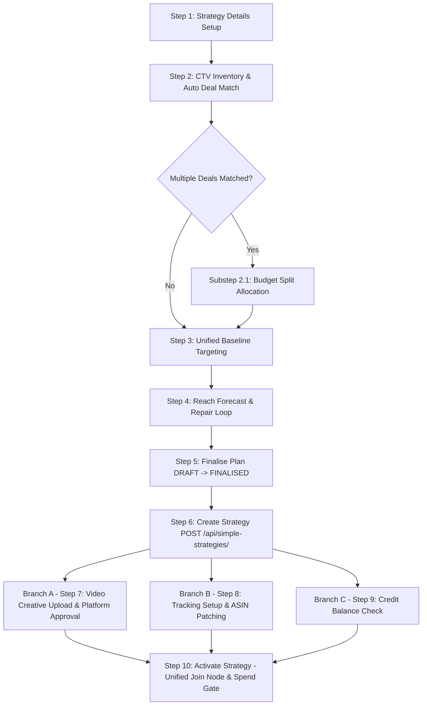

# Strategy Schema documentation v3.0

## VOW Platform — Strategy Schema (Final Operational Specification v3.0)

**Document Version:** 3.0.0 (Master Production Specification)  
**Supersedes:** Version 2.0.0, Version 1.1.0  

---

## 📑 Executive Summary & Key Changes in v3.0

This document represents the finalized, single source of truth for the **VOW Strategy Schema & Agentic Flow v3.0**.

### 🎯 Key Structural Evolution from v2.0 to v3.0:

1. **Clean Baseline Setup (Step 1):**  
   - Trader is asked for only 3 core inputs: **Flight Dates, Target Market, Total Budget**.
   - Strategy Name is **Auto-Generated** (`{Category}_{Market}_{Goal}_{MonthYear}`).
   - Primary Currency is **Auto-Derived** from Target Market ISO (`GB` $\rightarrow$ `GBP`).
   - Base Bids and Selling Location are **omitted** from Step 1.
   - Frequency Cap, Product Category, and Device Types are pre-populated via **Advertiser Profile Defaults** (`ADVERTISER_DEFAULT`).

2. **Automated Inventory Deal Matching & Budget Split Substep (Step 2):**  
   - UI Checkbox table removed. Agent auto-matches deals based on brief criteria.
   - Surfaced to trader: Channel/Provider, Blended CPM, Estimated Impressions (`specific_deal_id` preserved as escape hatch).
   - **Basil UI Refinement:** Budget Split is integrated as a dynamic **Substep inside Step 2** (activated when >1 deal is matched) rather than sitting as a separate standalone step.

3. **Unified Baseline Targeting (Step 3):**  
   - Audiences and Targeting merged into a single step.
   - Default Baseline (`ISO Country` + `Connected TV Only`) applied automatically upon deal selection.
   - Data Fees: VCPM fee depends on Data Provider (Amazon 1P £2.00 VCPM, 3P Experian £1.50 VCPM). Zero intra-provider compounding. Cross-provider stacking applies when crossing providers. Amazon 1P data can be applied across 3P inventory deals.

4. **Self-Service Plan Finalization (Step 5):**  
   - Step 7 in legacy flow renamed to **Finalise Plan**.
   - Simple status transition: `DRAFT` $\rightarrow$ `FINALISED`.
   - Manager approval routing, rejection logic, and `interrupt()` removed from this step.

5. **Minimal Creation & Post-Creation Strategy Patching (Step 6 & 8):**  
   - Strategy is created with a minimal payload via `POST /api/simple-strategies/`.
   - Measurement parameters (`product_asins`, `selling_location`, `conversions`) do not block creation and are patched post-creation via `PATCH /api/strategies/{id}/`.

6. **Order-Independent Parallel Setup Pipelines (Steps 7, 8, 9):**  
   - Post-creation steps run as 3 parallel independent branches:
     - **Branch A (Step 7):** Video Creative Upload (`click_through_url` optional for CTV) & Platform Creative Approval (`interrupt()` retained here).
     - **Branch B (Step 8):** Tracking Setup (Ad Tag registration & ASIN patching).
     - **Branch C (Step 9):** Credit Check & Top-up.

7. **Prerequisite Join Node at Activation (Step 10):**  
   - `Step 10: Activate Strategy` acts as a unified Join Node that verifies all completed prerequisites (`ready_to_activate`) before launching spend.

8. **Dynamic Open Channel Approval Dictionary:**  
   - Hard-coded channel approval rows replaced by dynamic dictionary: `creative_approval_statuses: dict[str, ApprovalStatusEnum]`, keyed dynamically by matched deals (e.g. Prime Video, Netflix, Paramount+, Channel 4).

---

## 1. Core Architecture & Design System Rules

### 1.1 CTV Taxonomy Distinction (Format vs Hardware Device)
- **Ad Format (`formats = ["streaming_tv"]`):** Fixed system constant representing streaming video content.
- **Device Type (`device_types = ["Connected TV"]`):** Physical hardware screen environment. Pre-filled from Advertiser Profile Defaults. `mobile_environment` field is conditional and activates only if `Mobile` device type is enabled.

### 1.2 Advertiser Profile Defaults Architecture (`AdvertiserDefaultsSchema`)
System fetches brand-level settings at session initialization:
```python
class AdvertiserSetting(BaseModel):
    value: Any
    is_locked: bool = Field(False, description="True = brand policy; trader cannot override and repair loop cannot relax")
    reason: Optional[str] = Field(None, description="Shown to trader when locked, e.g. 'brand policy: CTV only'")

class AdvertiserDefaultsSchema(BaseModel):
    frequency_cap: Optional[AdvertiserSetting] = None
    device_types: Optional[AdvertiserSetting] = None
    product_categories: Optional[AdvertiserSetting] = None
    product_location: Optional[AdvertiserSetting] = None
    primary_currency: Optional[AdvertiserSetting] = None
```

### 1.3 Audience Data Fees & Stacking Engine
1. **Intra-Provider Fixed Fee:** Multiple segments from the same data provider carry 1 fixed VCPM fee (e.g. Amazon 1P = £2.00 VCPM flat). Zero compounding.
2. **Cross-Provider Stacking:** Stacking occurs only when segments span distinct data providers:
   $$\text{Effective CPM} = \text{Base Deal CPM} + \text{Amazon 1P Fee (£2.00)} + \text{3P Provider Fee (£1.50)}$$
3. **Cross-Inventory Applicability:** Amazon 1P audiences can be attached to 3P deals (Netflix, Disney+, Paramount+).

---

## 2. The Agentic Flow — Step by Step (v3.0 Master Sequence)



---

## 3. Detailed Step Specifications & Schema Field Matrices

### Step 1: Strategy Details Setup
- **Goal:** Capture minimal brief inputs and auto-derive brand constants.

| Field Name | Data Type | Requirement | Source | Description / Business Rule |
|---|---|---|---|---|
| `flight_start_date` | Date (ISO) | **Required** | `ASKED` | Brief start date. Must be today or future. |
| `flight_end_date` | Date (ISO) | **Required** | `ASKED` | Brief end date. Must be after start date. |
| `markets` | List[str] | **Required** | `ASKED` | Single-market ISO code in M1 (e.g. `["GB"]`). |
| `total_budget` | Decimal | **Required** | `ASKED` | Numeric campaign budget (e.g. `10000.00`). |
| `strategy_name` | String | **Auto-Gen** | `GENERATED` | `{Category}_{Market}_{Goal}_{MonthYear}` (auto-appends `_v2` on collision). |
| `primary_currency` | String | **Auto-Derived**| `DERIVED` | Derived from Market ISO (`GB` $\rightarrow$ `GBP`, `US` $\rightarrow$ `USD`). |
| `formats` | List[str] | **Constant** | `FIXED` | Always `["streaming_tv"]`. |
| `goal` | Enum | **Constant** | `FIXED` | Always `AWARENESS`. |
| `kpi_target_type` | Enum | **Optional** | `INFERRED` | `reach` or `frequency` (defaults to `reach`). |
| `kpi_target_value` | Integer | **Optional** | `INFERRED` | Target frequency value between `1` and `5` (defaults to `3`). |
| `frequency_cap` | String | **Optional** | `ADVERTISER_DEFAULT` | Loaded from Advertiser Profile (e.g. `3 per 24 hours`). |
| `product_categories`| List[str] | **Optional** | `ADVERTISER_DEFAULT` | 3-Tier Fallback: Profile Default $\rightarrow$ Brief Inference $\rightarrow$ ASIN Metadata. |

---

### Step 2: CTV Inventory & Automated Deal Matching
- **Goal:** Auto-match rate card deals without surfacing complex UI checkbox tables.
- **Basil UI Substep Rule:** If >1 deal is matched, surface Budget Split directly inside Step 2 card before proceeding.

| Field Name | Data Type | Requirement | Source | Description / Business Rule |
|---|---|---|---|---|
| `selected_deals` | List[DealSchema] | **Auto-Matched** | `AGENT_MATCHED` | Agent matches deals using Market, Duration, Channel, Genre. |
| `specific_deal_id` | String | **Optional** | `ASKED` | Escape hatch for experienced traders to override auto-matching. |
| `budget_split` | Substep Schema | **Optional** | `ASKED / AGENT_PROPOSED` | Active when len(selected_deals) > 1. Proposes split per deal/duration. |

---

### Step 3: Unified Baseline Targeting
- **Goal:** Apply automated default baseline and allow optional audience/geo refinement.

| Field Name | Data Type | Requirement | Source | Description / Business Rule |
|---|---|---|---|---|
| `location` | List[str] | **Auto-Default**| `DERIVED` | Defaults to Target Market ISO (`["GB"]`). Can refine to postcodes. |
| `device_types` | List[str] | **Auto-Default**| `ADVERTISER_DEFAULT` | Loaded from Advertiser Profile (e.g. `["Connected TV"]`). |
| `mobile_environment`| Enum | **Conditional** | `ASKED` | Active only if `Mobile` $\in$ `device_types` (`in-app` vs `mobile_web`). |
| `audience_sets` | List[AudienceSchema] | **Optional** | `AGENT_SUGGESTED` | Agent suggests Narrow/Balanced/Wide profiles from flat suggest API. |
| `content_exclusions` | List[str] | **Optional** | `ADVERTISER_DEFAULT` | Brand safety exclusions. |

---

### Step 4: Reach Forecast & Repair Loop
- **Goal:** Calculate effective CPM, forecasted reach, impressions, and execute self-healing repair loop if reach falls short.

$$\text{Effective CPM} = \text{Blended Rate Card CPM} + \text{Applicable VCPM Data Fees}$$
$$\text{Estimated Impressions} = \left( \frac{\text{Total Budget}}{\text{Effective CPM}} \right) \times 1000$$

**CTV Repair Loop Levers (in priority order):**
1. Relax Geo / Content Exclusion Targeting (if not locked by brand policy).
2. Expand matched inventory deals (add additional providers/durations).
3. Relax Audience Segment Filters (move from Narrow to Wide or ROS).
4. Prompt trader to increase budget or flight duration.

---

### Step 5: Finalise Plan
- **Goal:** Trader reviews summary card and confirms finalization within the conversation.

| Field Name | Data Type | Requirement | Description / Business Rule |
|---|---|---|---|
| `plan_status` | PlanStatusEnum | **Required** | Transitions `DRAFT` $\rightarrow$ `FINALISED`. |
| `finalised_by` | String | **Auto-Set** | User ID of active trader. |
| `finalised_at` | Timestamp | **Auto-Set** | System timestamp on finalization. |

---

### Step 6: Create Strategy (`POST /api/simple-strategies/`)
- **Goal:** Persist minimal strategy shell to backend database.
- **Payload:** Contains core planning parameters from Steps 1–5 (`product_asins` initialized as `[]`).

---

### Step 7: Video Creative Upload & Platform Approval (Branch A)
- **Goal:** Upload video creative and track publisher-side approval.

| Field Name | Data Type | Requirement | Description / Business Rule |
|---|---|---|---|
| `video_asset_id` | String | **Required** | Uploaded video asset identifier. |
| `duration` | Integer | **Required** | Creative duration in seconds (must match plan durations). |
| `click_through_url` | HttpUrl | **Optional** | Optional for `streaming_tv` (no direct click on Smart TV screens). |
| `creative_approval_statuses`| Dict[str, Enum] | **Read-Only System** | Dynamic map keyed by matched deals: `{"Prime Video": "APPROVED", "Netflix": "PENDING"}`. |

*Note: LangGraph `interrupt()` is executed here to await asynchronous publisher review.*

---

### Step 8: Tracking & Conversions Setup (Branch B)
- **Goal:** Validate Ad Tag installation, collect ASINs, and update strategy record via `PATCH /api/strategies/{id}/`.

| Field Name | Data Type | Requirement | Description / Business Rule |
|---|---|---|---|
| `ad_tag_registered` | Boolean | **Required** | Verifies advertiser conversion tracking pixel on site. |
| `product_asins` | List[str] | **Optional** | ASIN list validated via `POST /api/contextual-targeting/GB/asin-validation/`. |
| `selling_location` | Enum | **Optional** | Pre-populated from Advertiser Profile (`ON_AMAZON` / `NOT_SOLD_ON_AMAZON`). |

---

### Step 9: Credit Balance Check (Branch C)
- **Goal:** Verify account credit balance against campaign budget.

---

### Step 10: Activate Strategy (Unified Join Node & Spend Gate)
- **Goal:** Final spend gate evaluating all prerequisite pipelines.

```python
class ActivationPrerequisitesSchema(BaseModel):
    creative_uploaded: dict[str, bool]       # per duration: {"30": True, "15": True}
    creative_approved: dict[str, ApprovalStatusEnum] # per channel: {"Prime Video": APPROVED}
    ad_tag_registered: Optional[bool] = None
    asins_attached: bool = False
    credit_sufficient: bool = False

    @property
    def ready_to_activate(self) -> bool:
        return (
            all(self.creative_uploaded.values()) and
            all(status == ApprovalStatusEnum.APPROVED for status in self.creative_approved.values()) and
            self.credit_sufficient
        )
```

---

## 4. API Endpoints Contract Map

| Action | HTTP Method | Endpoint Route | Description |
|---|---|---|---|
| **Fetch Advertiser Defaults** | `GET` | `/api/advertisers/{id}/defaults/` | Pre-fills brand settings at session start. |
| **Check Strategy Uniqueness** | `GET` | `/api/strategies/check_strategy_name_uniqueness/` | Verifies auto-generated name uniqueness. |
| **Match Inventory Deals** | `POST` | `/api/rate-cards/match/` | Auto-matches deals by market, duration, channel. |
| **Suggest Audience Segments** | `POST` | `/api/audience-sets/suggest/` | Returns flat list of recommended segments. |
| **Create Strategy Shell** | `POST` | `/api/simple-strategies/` | Creates minimal strategy record post-finalization. |
| **ASIN Validation** | `POST` | `/api/contextual-targeting/{market}/asin-validation/` | Validates ASIN list and returns category metadata. |
| **Patch Strategy Tracking** | `PATCH` | `/api/strategies/{id}/` | Patches ASINs & selling location in Step 8. |
| **Activate Strategy** | `POST` | `/api/strategies/{id}/activate/` | Triggers live spend delivery. |

---

## 5. Summary for Implementation Teams

- **AI/Agent Lead:** Implement nodes in `vow_agent/app/agent/graph.py` following the 6 sequential planning nodes + 3 parallel branch sub-graphs + Step 10 activation join node.
- **Frontend Lead:** Render Step 2 Inventory card with Budget Split as an inline substep when >1 deal is matched. Render post-creation UI as a dynamic prerequisite checklist.
- **Backend Team:** Expose `POST /api/simple-strategies/` and `PATCH /api/strategies/{id}/` endpoints supporting dynamic dictionary fields.
- **QA Team:** Validate zero intra-provider compounding, cross-provider stacking, and locked advertiser device policy enforcement.

---
*End of Strategy Schema Documentation v3.0*
