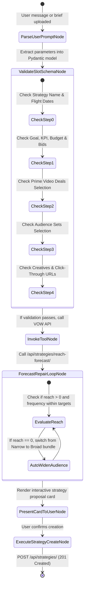

# VOW Platform - Strategy Module Technical Specification & Schema Registry

**Document Version:** 1.0.0  
**Target Audience:** AI Engineering, Backend Engineers, Frontend Engineers, Product Managers  
**Status:** Approved Technical Architecture & Data Registry  

---

## 1. Executive Summary & Core System Architecture

This document serves as the **Single Source of Truth (SSOT)** for the **Strategy Module** and the **Planning Agent** within the VOW Advertising Platform. It defines the system architecture, business rules, field-by-field schema matrices, REST API integration contracts, Pydantic data models, and the state-machine execution flow.

```
                  +-------------------------------------------------------+
                  |               USER INTERFACE / BRIEF INPUT            |
                  +-------------------------------------------------------+
                                              |
                                              v
                  +-------------------------------------------------------+
                  |         LANGGRAPH PLANNING AGENT (STATE ENGINE)        |
                  |  - Stateful Slot Filling & Slot Verification          |
                  |  - Schema Validation via Pydantic Data Models         |
                  +-------------------------------------------------------+
                                              |
                                              v
                  +-------------------------------------------------------+
                  |              VOW REST API ENGINE / TOOLS              |
                  |  - Uniqueness & ASIN Validation Calls                 |
                  |  - Audience Vector Search & Suggestion Engine         |
                  |  - Reach & Frequency Forecasting Engine               |
                  |  - Amazon DSP Campaign Entity Creation                |
                  +-------------------------------------------------------+
                                              |
                                              v
                  +-------------------------------------------------------+
                  |             DATABASE & AMAZON DSP SYNC ENGINE         |
                  +-------------------------------------------------------+
```

### Core Architectural Principles

1. **Zero-Hallucination Policy**: The Planning Agent NEVER invents strategy parameters, metrics, targeting criteria, or deal IDs out of its LLM weights. It only populates values verified against the VOW Database and official REST APIs.
2. **Self-Filling Form Paradigm**: The agent operates as a stateful slot-filling engine backed by **LangGraph**. Inputs received via natural language chat or uploaded brief documents are parsed into registered Pydantic slot schemas.
3. **API-Driven Tool Execution**: Every step of the strategy workflow maps directly to official VOW API endpoints for choice retrieval, validation, audience suggestion, reach forecasting, and campaign draft persistence.

---

## 2. Business Logic & Domain Architecture

### 2.1 Product Attribution & Selling Locations
- **On Amazon (`ON_AMAZON`) [Endemic]**:
  - Used when the advertiser sells products directly on Amazon marketplace.
  - **Product ASINs**: **REQUIRED**. Entering valid ASINs enables tracking of Detail Page Views (DPV), Add to Cart (ATC), Purchases, and Return on Ad Spend (ROAS).
- **Off Amazon (`NOT_SOLD_ON_AMAZON`) [Non-Endemic]**:
  - Used when the advertiser drives traffic to an external direct-to-consumer (D2C) site, application, or landing page.
  - **Product ASINs**: **OPTIONAL**. If provided, ASINs are monitored to measure organic Amazon halo sales resulting from off-Amazon ad impressions.
  - **Ad Tag Conversions**: Required to track site events (Page Views, Add to Cart, Checkout, Application submissions).

### 2.2 Attribution & Lookback Windows
- **Default Window**: 14-day post-view and post-click attribution window for DSP campaign performance reporting.

### 2.3 Deal Types & Pricing Models
- **Programmatic Guaranteed (PG)**: Reserved inventory with fixed CPM and guaranteed impression volume.
- **Preferred Deals**: Non-guaranteed inventory with agreed fixed CPM pricing.
- **Private Auctions**: Floor-priced competitive auctions across premium publisher inventory.

### 2.4 Audience Set Bundling Profiles
When generating recommended audience sets, the agent produces three distinct operational profiles:
1. **Narrow (High Precision)**: Highly targeted in-market and lifestyle segments with tight reach and elevated conversion intent.
2. **Balanced (Recommended)**: Optimal blend of high-intent in-market segments and broader affinity audiences.
3. **Broad (Maximum Scale)**: Wide demographic and interest-based reach for top-of-funnel brand awareness.

---

## 3. End-to-End Strategy Wizard Specifications (6 Steps)

### 3.1 Wizard Step 1: Strategy Details (`step=0`)

```
+---------------------------------------------------------------------------------------------------+
|  New Strategy: DSP                                                     [Save as draft] [Discard] |
|  Strategy details (Step 1 of 5)                                                                  |
+---------------------------------------------------------------------------------------------------+
|  1. Strategy name               : [ Text Input e.g. Summer_Brand_Awareness_2026               ] |
|  2. Flight dates                : [ Range Picker e.g. 01/08/2026 - 31/08/2026                 ] |
|  3. Target markets              : [ Dropdown e.g. United Kingdom (GB)                          ] |
|  4. Primary currency            : [ Dropdown e.g. € - EUR / £ - GBP / $ - USD                   ] |
|  5. Formats & Product Categories: [ ] Display  [ ] Online Video  [ ] Streaming TV  [x] Prime Video|
|  6. Product Categories          : [ Dropdown e.g. Education (1)                              ] |
|  7. Where do you sell products? : ( ) On Amazon  (x) Off Amazon                                   |
|  8. Type or paste product ASINs : [ Textarea e.g. B08N5WRWNW (Comma separated)                ] |
+---------------------------------------------------------------------------------------------------+
```

#### Field Matrix & Validation Rules

| Field Name | Type | Requirement | Validation & API Execution |
| :--- | :--- | :--- | :--- |
| **Strategy Name** | String | **Required** | Must be unique across advertiser account. Validated via `GET /api/strategies/check_strategy_name_uniqueness/`. |
| **Flight Dates** | Date Range | **Required** | Start date (`lower`) must be $\ge$ current date; End date (`upper`) must be $>$ start date. |
| **Target Markets** | Multi-Select | **Required** | ISO 2-letter country code (e.g., `GB`, `US`, `DE`). Triggers asset, audience, and creative pre-checks. |
| **Primary Currency**| Dropdown | **Required** | ISO Currency Code (`EUR`, `GBP`, `USD`). Controls reporting display. |
| **Ad Formats** | Multi-Select | **Required** | Choices: `display`, `online_video`, `streaming_tv`, `prime_video`. |
| **Product Categories**| Multi-Select | **Required for Video** | Required when video/Prime Video formats are selected. Fetched via `GET /api/contextual-targeting/{market}/product-categories/`. |
| **Selling Location** | Radio | **Required** | Options: `ON_AMAZON` (Endemic) or `NOT_SOLD_ON_AMAZON` (Non-Endemic). |
| **Product ASINs** | Textarea | **Conditional** | **If `ON_AMAZON`**: **REQUIRED**.<br>**If `NOT_SOLD_ON_AMAZON`**: **OPTIONAL**.<br>Validated via `POST /api/contextual-targeting/{market}/asin-validation/`. |

---

### 3.2 Wizard Step 2: Goal, KPI & Bid (`step=1`)

```
+---------------------------------------------------------------------------------------------------+
|  New Strategy: DSP                                                     [Save as draft] [Discard] |
|  Goal, KPI & Bid (Step 2 of 5)                                                                   |
+---------------------------------------------------------------------------------------------------+
|  Goal & KPI:                                                                                      |
|  1. Goal Selection                     : [x] Awareness    [ ] Consideration    [ ] Conversion     |
|  2. KPI Target                         : [x] Reach        [ ] Frequency                           |
|  3. Ad Tag Conversions (Off-Amazon)    : [x] Page view    [x] Checkout    [x] Add to cart         |
|                                                                                                   |
|  Budget & Bid Allocation:                                                                         |
|  4. Market Budget Table                : Market: United Kingdom (GB)                              |
|                                          Budget: [ Input e.g. 10000                            ] |
|                                          Base bid: [ Input e.g. 30                              ] |
+---------------------------------------------------------------------------------------------------+
|  [Back]                                                                             [Next: Deals] |
+---------------------------------------------------------------------------------------------------+
```

#### Field Matrix & Validation Rules

| Field Name | Type | Requirement | Validation & API Execution |
| :--- | :--- | :--- | :--- |
| **Strategy Goal** | Card Select | **Required** | Choices: `AWARENESS`, `CONSIDERATION`, `CONVERSION`. |
| **KPI Target** | Card Select | **Required** | Choices based on format/goal (`reach`, `frequency`, `ctr`, `cpc`, `cpa`, `cpdpv`). |
| **Ad Tag Conversions**| Multi-Select Dropdown | **Required (Off-Amazon)** | Event choices fetched via `GET /api/conversions/definitions/` (`Page view`, `Add to shopping cart`, `Checkout`, `Application`). |
| **Market Budgets** | Table Input | **Required** | Total budget per target market (must be $> 0$). |
| **Base Bids** | Table Input | **Required** | Max base CPM bid per market (must be $> 0$). |

---

### 3.3 Wizard Step 3: Deals Selection (`step=2`)

```
+---------------------------------------------------------------------------------------------------+
|  New Strategy: DSP                                                     [Save as draft] [Discard] |
|  Deals (Step 3 of 5) - Prime Video Deals                                                         |
+---------------------------------------------------------------------------------------------------+
|  Filters: [Market: GB] [Ad length: All] [Genre: All] [Deal type: All] [Search Deals...]           |
|                                                                                                   |
|  Deals Selection Table:                                                Selected Deals:            |
|  +-------------------------------------------------------------+-----+  🇬🇧 United Kingdom         |
|  | Deal Name                              | Deal Type  | CPM   | [x] |  - Prime Video Preferred  |
|  +-------------------------------------------------------------+-----+    Deal | UK - 30 - ROS    |
|  | Prime Video | Preferred Deal | UK - 30  | Preferred  | £28.88| [x] |    (CPM £28.88 Fixed)     |
|  +-------------------------------------------------------------+-----+                            |
+---------------------------------------------------------------------------------------------------+
|  [Back]                                                                         [Next: Audiences] |
+---------------------------------------------------------------------------------------------------+
```

#### Field Matrix & Validation Rules

| Field Name | Type | Requirement | Validation & API Execution |
| :--- | :--- | :--- | :--- |
| **Selected Deals** | Checkbox Table | **Required for Video Deals** | Fetched via `GET /api/deals/?markets={market}&formats={format}`. User must check at least one active deal to proceed. |

---

### 3.4 Wizard Step 4: Audience Sets (`step=3`)

```
+---------------------------------------------------------------------------------------------------+
|  New Strategy: DSP                                                     [Save as draft] [Discard] |
|  Audiences (Step 4 of 5) - Audience sets (all markets)                                           |
+---------------------------------------------------------------------------------------------------+
|  Filters: [Fee: All] [Goal: Awareness] [Search audience sets...]                                  |
|                                                                                                   |
|  Audience Sets Table:                                                  Selected Audiences:        |
|  +-------------------------------------------------------------+-----+  [Similar] [Exact]          |
|  | Audience Set Name              | VCPM   | Market | Goal     | [x] |  🇬🇧 United Kingdom         |
|  +-------------------------------------------------------------+-----+  - Healthy snacks          |
|  | Healthy snacks                 | £1.63  | 🇬🇧     | Awareness| [x] |    (VCPM £1.63)           |
|  +-------------------------------------------------------------+-----+                            |
+---------------------------------------------------------------------------------------------------+
|  [Back]                                                                         [Next: Creatives] |
+---------------------------------------------------------------------------------------------------+
```

#### Field Matrix & Validation Rules

| Field Name | Type | Requirement | Validation & API Execution |
| :--- | :--- | :--- | :--- |
| **Matching Mode** | Toggle | **Required** | Options: `Similar` vs `Exact`. |
| **Selected Audience Sets**| Checkbox Table | **Required** | Fetched via `GET /api/audience-sets/` or suggested via `POST /api/audience-sets/suggest/`. At least one audience set must be selected. |

---

### 3.5 Wizard Step 5: Creatives Binding (`step=4`)

```
+---------------------------------------------------------------------------------------------------+
|  New Strategy: DSP                                                     [Save as draft] [Discard] |
|  Creatives (Step 5 of 5)                                                                         |
+---------------------------------------------------------------------------------------------------+
|  Filters: [Language: All] [Search...]                                                             |
|                                                                                                   |
|  Creatives Selection Table:                                            Selected Creatives:        |
|  +-------------------------------------------------------------+-----+  🇬🇧 Creatives (UK)          |
|  | Asset Name                     | Language | Markets         | [x] |  - SC_WGY_30s_HEART_Online|
|  +-------------------------------------------------------------+-----+    Type: Streaming TV      |
|  | SC_WGY_30s_HEART_Online_16x9  | English  | 🇬🇧              | [x] |    Insert click-through URL|
|  +-------------------------------------------------------------+-----+    [ https://example.com ] |
+---------------------------------------------------------------------------------------------------+
|  [Back]                                                                           [Next: Summary] |
+---------------------------------------------------------------------------------------------------+
```

#### Field Matrix & Validation Rules

| Field Name | Type | Requirement | Validation & API Execution |
| :--- | :--- | :--- | :--- |
| **Selected Assets** | Checkbox Table | **Required** | Fetched via `GET /api/assets/`. Triggers `GET /api/creatives/?approval_status=APPROVED`. |
| **Click-Through URL** | Text Input | **Required** | Target landing page URL must be provided for every selected creative asset. |

---

### 3.6 Wizard Step 6: Summary & Strategy Creation (`step=5`)

```
+---------------------------------------------------------------------------------------------------+
|  New Strategy: DSP                                                     [Save as draft] [Discard] |
|  Summary (Step 6 of 6)                                                                            |
+---------------------------------------------------------------------------------------------------+
|  Summary Overview Cards:                                                                          |
|  1. Strategy Details [Edit] : Name, Dates, Markets, Currency, Product Location                    |
|  2. Goal, KPI & Bid [Edit]   : Goal, KPI, Conversions, Market Budgets, Base Bids                 |
|  3. Deals [Edit]             : Selected Deals & Pricing Models                                    |
|  4. Audience Sets [Edit]     : Selected Audience Sets & Matching Modes                            |
|  5. Creatives [Edit]         : Selected Assets & Click-Through Landing URLs                        |
+---------------------------------------------------------------------------------------------------+
|  [Back]                                                                         [Create Strategy] |
+---------------------------------------------------------------------------------------------------+
```

---

## 4. API Catalog & Integration Contracts

### 4.1 Master REST Endpoint Matrix

| Operation ID | Method | Endpoint Path | Description |
| :--- | :--- | :--- | :--- |
| `strategies_choices_list` | `GET` | `/api/strategies/choices/` | Retrieves dropdown enum choices (goals, KPIs, channels, currencies). |
| `strategies_check_strategy_name_uniqueness` | `GET` | `/api/strategies/check_strategy_name_uniqueness/` | Validates uniqueness of strategy name string. |
| `contextual-targeting_asin-validation_create` | `POST` | `/api/contextual-targeting/{market}/asin-validation/` | Validates input ASIN list against Amazon Catalog API. |
| `contextual-targeting_product-categories_list` | `GET` | `/api/contextual-targeting/{market}/product-categories/` | Fetches available product categories for deal targeting. |
| `conversions_definitions_list` | `GET` | `/api/conversions/definitions/` | Fetches ad tag conversion definitions for off-Amazon strategies. |
| `deals_list` | `GET` | `/api/deals/` | Lists available programmatic deals filtered by format and market. |
| `deals_filter_properties` | `GET` | `/api/deals/filter-properties/` | Fetches filter facets (Ad length, Genre, Deal type). |
| `audience-sets_list` | `GET` | `/api/audience-sets/` | Lists pre-curated audience sets for target markets. |
| `audience-sets_suggest_create` | `POST` | `/api/audience-sets/suggest/` | Generates recommended audience sets via vector similarity search. |
| `audience-sets_reach-forecast_create` | `POST` | `/api/audience-sets/reach-forecast/` | Forecasts unique reach and impressions for selected audience sets. |
| `assets_list` | `GET` | `/api/assets/` | Lists registered image/video media assets. |
| `creatives_list` | `GET` | `/api/creatives/` | Validates approved Amazon DSP creative tags. |
| `strategies_reach_forecast` | `POST` | `/api/strategies/reach-forecast/` | Calculates complete strategy reach and frequency curve. |
| `strategies_draft_create` | `POST` | `/api/strategies/draft/` | Persists partial draft strategy configuration. |
| `strategies_create` | `POST` | `/api/strategies/` | Creates and publishes full strategy in VOW DB (`201 Created`). |
| `strategies_read` | `GET` | `/api/strategies/{id}/` | Reads created strategy overview details. |

---

### 4.2 API Payload & Response Specifications

#### 1. Check Strategy Name Uniqueness
- **Request**: `GET /api/strategies/check_strategy_name_uniqueness/?name=Summer_Brand_Awareness_2026`
- **Response (`200 OK`)**:
```json
{
  "is_unique": true,
  "name": "Summer_Brand_Awareness_2026"
}
```

#### 2. ASIN Validation API
- **Request**: `POST /api/contextual-targeting/GB/asin-validation/`
- **Payload**:
```json
{
  "asins": ["B08N5WRWNW", "B09B3H5F2C"]
}
```
- **Response (`200 OK`)**:
```json
{
  "valid_asins": [
    {
      "asin": "B08N5WRWNW",
      "title": "Wireless Noise Cancelling Headphones",
      "brand": "AudioBrand",
      "image_url": "https://m.media-amazon.com/images/I/sample.jpg",
      "product_category": "Electronics"
    }
  ],
  "invalid_asins": []
}
```

#### 3. Audience Suggestion Engine API
- **Request**: `POST /api/audience-sets/suggest/`
- **Payload**:
```json
{
  "market": "GB",
  "goal": "AWARENESS",
  "product_categories": ["Education"],
  "brief_text": "Driving high awareness for online learning platforms in UK"
}
```
- **Response (`200 OK`)**:
```json
{
  "bundles": {
    "narrow": [
      {"id": "aud_101", "name": "Higher Education Seekers", "vcpm": "1.85", "estimated_reach": 450000}
    ],
    "balanced": [
      {"id": "aud_101", "name": "Higher Education Seekers", "vcpm": "1.85", "estimated_reach": 450000},
      {"id": "aud_102", "name": "E-Learning & Tech Enthusiasts", "vcpm": "1.63", "estimated_reach": 1200000}
    ],
    "broad": [
      {"id": "aud_101", "name": "Higher Education Seekers", "vcpm": "1.85", "estimated_reach": 450000},
      {"id": "aud_102", "name": "E-Learning & Tech Enthusiasts", "vcpm": "1.63", "estimated_reach": 1200000},
      {"id": "aud_103", "name": "General Career Advancement", "vcpm": "1.20", "estimated_reach": 3500000}
    ]
  }
}
```

#### 4. Strategy Reach & Frequency Forecast API
- **Request**: `POST /api/strategies/reach-forecast/`
- **Payload**:
```json
{
  "markets": ["GB"],
  "budget": "10000.00",
  "base_bid": "30.00",
  "formats": ["prime_video"],
  "audience_set_ids": ["aud_101", "aud_102"],
  "flight_dates": {
    "lower": "2026-08-01",
    "upper": "2026-08-31"
  }
}
```
- **Response (`200 OK`)**:
```json
{
  "estimated_impressions": 333333,
  "estimated_unique_reach": 210000,
  "average_frequency": 1.58,
  "indicative_cpm": "30.00",
  "reach_curve": [
    {"budget": 2500, "reach": 65000},
    {"budget": 5000, "reach": 120000},
    {"budget": 7500, "reach": 170000},
    {"budget": 10000, "reach": 210000}
  ]
}
```

#### 5. Full Strategy Creation API
- **Request**: `POST /api/strategies/`
- **Payload**:
```json
{
  "name": "Summer_Brand_Awareness_2026",
  "advertiser_id": "353eea43-bc42-456f-ba4f-3d3e20ea6bc8",
  "channel_type": "dsp",
  "goal": "AWARENESS",
  "kpi_target_type": "reach",
  "primary_currency": "GBP",
  "flight_dates": {
    "lower": "2026-08-01",
    "upper": "2026-08-31",
    "bounds": "[)"
  },
  "product_location": "NOT_SOLD_ON_AMAZON",
  "product_asins": [],
  "formats": ["prime_video"],
  "product_categories": [1],
  "market_budgets": [
    {"market": "GB", "budget": "10000.00", "base_bid": "30.00"}
  ],
  "ad_tag_conversions": ["Page view", "Checkout"],
  "selected_deals": ["EXT7P75718S8MNR"],
  "selected_audience_sets": ["aud_101", "aud_102"],
  "selected_creatives": [
    {
      "asset_id": "asset_99812",
      "click_through_url": "https://example.com/landing"
    }
  ]
}
```
- **Response (`201 Created`)**:
```json
{
  "id": "VMA2026365",
  "name": "Summer_Brand_Awareness_2026",
  "status": "draft",
  "is_syncing": true,
  "created_at": "2026-07-27T17:55:00Z"
}
```

---

## 5. Python Pydantic Data Models (Production Grade)

```python
from enum import Enum
from typing import List, Optional, Dict, Any
from pydantic import BaseModel, Field, HttpUrl

# ==========================================
# ENUM DEFINITIONS
# ==========================================

class ChannelTypeEnum(str, Enum):
    DSP = "dsp"
    SPONSORED = "sponsored"

class GoalEnum(str, Enum):
    AWARENESS = "AWARENESS"
    CONSIDERATION = "CONSIDERATION"
    CONVERSION = "CONVERSION"

class KPIEnum(str, Enum):
    REACH = "reach"
    FREQUENCY = "frequency"
    CTR = "ctr"
    CPC = "cpc"
    CPA = "cpa"
    CPDPV = "cpdpv"

class ProductLocationEnum(str, Enum):
    ON_AMAZON = "ON_AMAZON"
    NOT_SOLD_ON_AMAZON = "NOT_SOLD_ON_AMAZON"

class FormatEnum(str, Enum):
    DISPLAY = "display"
    ONLINE_VIDEO = "online_video"
    STREAMING_TV = "streaming_tv"
    PRIME_VIDEO = "prime_video"

class CurrencyEnum(str, Enum):
    EUR = "EUR"
    GBP = "GBP"
    USD = "USD"

# ==========================================
# STEP-BY-STEP SLOT SCHEMAS
# ==========================================

class DateRangeSchema(BaseModel):
    lower: str = Field(..., description="ISO Date String YYYY-MM-DD")
    upper: str = Field(..., description="ISO Date String YYYY-MM-DD")
    bounds: str = Field("[)", description="Interval boundary notation")

class Step1DetailsSlotSchema(BaseModel):
    """Slots extracted in Step 1: Strategy Details"""
    name: str = Field(..., description="Unique Strategy Name")
    flight_dates: DateRangeSchema = Field(..., description="Campaign Flight Date Range")
    markets: List[str] = Field(..., description="ISO 2-letter Country Codes e.g. ['GB']")
    primary_currency: CurrencyEnum = Field(CurrencyEnum.GBP, description="Reporting Currency")
    formats: List[FormatEnum] = Field(..., description="Selected Ad Formats")
    product_categories: List[int] = Field(default_factory=list, description="Target Product Category IDs")
    product_location: ProductLocationEnum = Field(..., description="ON_AMAZON | NOT_SOLD_ON_AMAZON")
    product_asins: List[str] = Field(default_factory=list, description="Product ASINs list")

class MarketBudgetBidSchema(BaseModel):
    market: str = Field(..., description="ISO 2-letter Country Code")
    budget: str = Field(..., description="Total Budget Decimal String")
    base_bid: str = Field(..., description="Base Bid Decimal String")

class Step2GoalKPIBidSlotSchema(BaseModel):
    """Slots extracted in Step 2: Goal, KPI & Bid"""
    goal: GoalEnum = Field(..., description="Primary Strategy Goal")
    kpi_target_type: KPIEnum = Field(..., description="Primary Metric Target")
    ad_tag_conversions: List[str] = Field(default_factory=list, description="Tracked Ad Tag Conversion Events")
    market_budgets: List[MarketBudgetBidSchema] = Field(..., description="Per-market Budget and Bid Allocations")

class SelectedDealSchema(BaseModel):
    deal_id: str = Field(..., description="Deal ID e.g. EXT7P75718S8MNR")
    name: str = Field(..., description="Deal Name")
    cpm: str = Field(..., description="Fixed or Floor CPM Price")

class Step3DealsSlotSchema(BaseModel):
    """Slots extracted in Step 3: Deals Selection"""
    selected_deals: List[SelectedDealSchema] = Field(..., description="Selected Inventory Deals")

class SelectedAudienceSetSchema(BaseModel):
    audience_set_id: str = Field(..., description="Audience Set UUID")
    name: str = Field(..., description="Audience Set Name")
    vcpm_fee: str = Field(..., description="VCPM Fee Decimal")

class Step4AudienceSlotSchema(BaseModel):
    """Slots extracted in Step 4: Audience Sets"""
    matching_mode: str = Field("Exact", description="Similar | Exact")
    selected_audience_sets: List[SelectedAudienceSetSchema] = Field(..., description="Selected Audience Sets")

class SelectedCreativeSchema(BaseModel):
    asset_id: str = Field(..., description="Registered Asset ID")
    click_through_url: HttpUrl = Field(..., description="Target Click-Through Landing Page URL")

class Step5CreativeSlotSchema(BaseModel):
    """Slots extracted in Step 5: Creatives Binding"""
    selected_creatives: List[SelectedCreativeSchema] = Field(..., description="Selected Media Assets with URLs")

# ==========================================
# COMPREHENSIVE FULL STRATEGY SCHEMA
# ==========================================

class FullStrategySchema(BaseModel):
    id: Optional[str] = Field(None, description="System Assigned Strategy ID (e.g. VMA2026365)")
    advertiser_id: str = Field(..., description="Parent Advertiser UUID")
    channel_type: ChannelTypeEnum = ChannelTypeEnum.DSP
    details: Step1DetailsSlotSchema
    goal_kpi_bid: Step2GoalKPIBidSlotSchema
    deals: Step3DealsSlotSchema
    audiences: Step4AudienceSlotSchema
    creatives: Step5CreativeSlotSchema
    status: str = Field("draft", description="draft | active | paused")
    is_syncing: bool = Field(False, description="Background DSP sync status")
```

---

## 6. LangGraph Planning Agent State Machine & Workflow

### 6.1 State TypedDict Definition

```python
from typing import TypedDict, List, Dict, Any, Optional

class PlanningAgentState(TypedDict):
    """State Dictionary passed across LangGraph nodes"""
    messages: List[Dict[str, Any]]
    advertiser_id: str
    current_step: int  # 0 to 5
    strategy_id: Optional[str]
    step1_details: Optional[Dict[str, Any]]
    step2_goal_kpi_bid: Optional[Dict[str, Any]]
    step3_deals: Optional[Dict[str, Any]]
    step4_audiences: Optional[Dict[str, Any]]
    step5_creatives: Optional[Dict[str, Any]]
    forecast_results: Optional[Dict[str, Any]]
    validation_errors: List[str]
    is_complete: bool
```

---

### 6.2 LangGraph Node Transition Diagram



---

## 7. Verification & Implementation Checklist

### For Backend & AI Engineers:
- [x] Verify unique name endpoint (`GET /api/strategies/check_strategy_name_uniqueness/`).
- [x] Ensure ASIN validation handler parses `ON_AMAZON` vs `NOT_SOLD_ON_AMAZON` conditional logic.
- [x] Wire LangGraph tool definitions to call `/api/audience-sets/suggest/` with vector search fallback.
- [x] Implement the auto-widening forecast repair loop when `estimated_unique_reach == 0`.
- [x] Ensure `POST /api/strategies/` payload matches `FullStrategySchema` for `201 Created` status.
